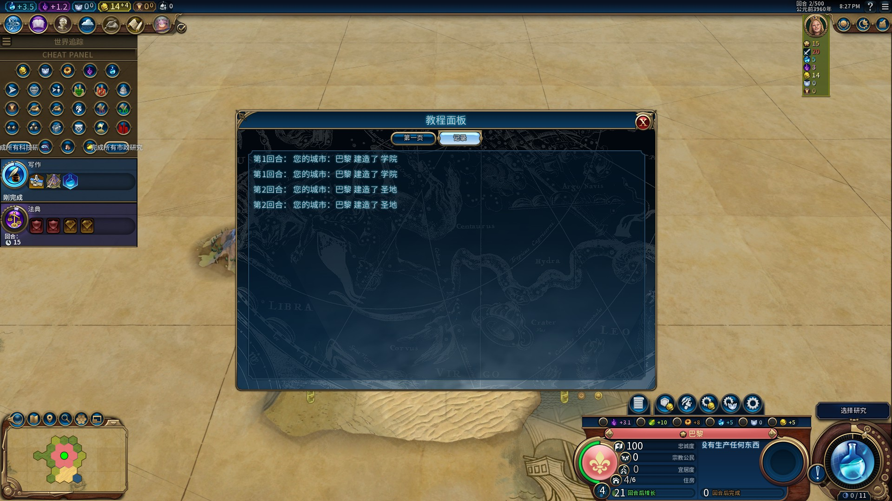

# 糸七 的文明6mod教程

## 前言

本文并非基础教学，而是各种实例，内容可能比较杂，可以根据目录按需观看，无需按顺序看。

## 致谢

我要感谢所有在lua方面对我有过帮助的modder，比如Hemmelfort、枫叶、优妮，以及大量modder的优质mod，让我迅速累积了大量经验来完成本教程。

作者：糸七，1802646926

## 正文

### 前置知识

本文不会从最基础的知识讲起，默认你已经学习过以下教程：

- Hemmelfort的[Github](https://github.com/Hemmelfort/Civ6ModdingNotes)和[Gitee](https://gitee.com/Hemmelfort/Civ6ModdingNotes)，以及b站[视频](https://www.bilibili.com/video/BV1VW411U7tN/)和专栏。
- 枫叶的[文明6lua教程](https://github.com/FYMapleLeaves/ml-civ6-lua-tutorial/blob/main/%E6%9E%AB%E5%8F%B6%E7%9A%84%E6%96%87%E6%98%8E6lua%E6%95%99%E7%A8%8B.md)。

文明6常用目录

- Log位置（伟大建设者包更新后）：**C:\Users\用户\AppData\Local\Firaxis Games\Sid Meier's Civilization VI\Logs**
- 非创意工坊mod放置位置：**C:\Users\用户\文档\My Games\Sid Meier's Civilization VI\Mods**
- 文明6游戏文件目录（Steam）：**\Steam\steamapps\common\Sid Meier's Civilization VI**
- Steam创意工坊mod文件目录：**\Steam\steamapps\workshop\content\289070**

### 1. lua

#### 1.1 UI

基础知识：加载你的UI文件

通常而言，你需要新建两个文件，通常会放在UI文件夹。

UI.xml
UI.lua

值得注意的是，尽可能不要使用可能撞名的文件名字，这里只是用作示范才取简单名字。

如果你不需要新增UI，而是为了使用一些必须在UI环境才能使用的函数，在UI.xml写下：

```xml
<?xml version="1.0" encoding="utf-8"?>
<Context>
</Context>
```

然后再在.modinfo这样写：

```xml
<AddUserInterfaces id="UI">
  	<Properties>
    	    <Context>InGame</Context>
  	</Properties>
	<File>UI/UI.xml</File>
</AddUserInterfaces>

```

加载.xml文件后会自动加载同名的.lua文件

##### 1.1.1 单位按钮：移除奢侈品

如果只是做单位按钮，实际上h佬和枫叶佬已经讲得很详细了，所以这里借用单位按钮讲解一些基本原理。

新建两个文件，为了方便，在这里简单命名为：
Siqi_UnitPanel.lua
Siqi_UnitPanel.xml

Siqi_UnitPanel.xml这么写：

```xml
<?xml version="1.0" encoding="utf-8"?>
<Context>
	<Grid ID="UnitGrid" Anchor="R,B" Size="auto,41" AutoSizePadding="6,0" Texture="SelectionPanel_ActionGroupSlot" SliceCorner="5,19" SliceSize="1,1" SliceTextureSize="12,41" ConsumeMouse="1" Hidden="1">
		<Button ID="UnitButton" Anchor="C,B" Size="44,53" Texture="UnitPanel_ActionButton">
			<Image ID="UnitButtonIcon"		Anchor="C,C" Offset="0,-2" Size="38,38"  Icon="ICON_UNITOPERATION_HARVEST_RESOURCE"/>
		</Button>
	</Grid>
</Context>
```

> 通常而言，这个xml所表示的单位按钮长这样：
> ``<Grid></Grid>``是最外面的矩形框架，其参数定义了其的位置，大小，样式
> ``<Button></Button>``是中间的圆形按钮，其参数定义了其的位置，大小，样式
> ``<Image></Image>``是最里面的收割图标，Icon是对应图标的名字。

大部分参数无需理会，已经是大佬做好了的，通常只需关注Icon即可，选择合适的图标来让你的单位按钮更具特色吧。

做好了单位按钮，接下来我们需要按照下面的思路来编写lua代码：

```
按钮怎么绑在单位面板上？
什么时候显示？
什么时候可用，什么时候不可用？
对应的文本是什么？
按了之后会发生什么？
```

为了能更好的进行教程，我们来设计一个简单的小能力：

```
建造者清除领土内的奢侈品资源，并且获得科技或者文化。
```

现在，我们按照上面的思路来一步步完成代码吧：

###### **1、初始化**

```lua

-- 单位按钮初始化
function Init()
	local pContext = ContextPtr:LookUpControl("/InGame/UnitPanel/StandardActionsStack")
	if pContext ~= nil then
		Controls.UnitGrid:ChangeParent(pContext)
        Controls.UnitButton:RegisterCallback(Mouse.eLClick, OnButtonClicked)
	end
end

-- Initialize通常用来初始化整个lua文件的函数
function Initialize()
    Init()  
end

Events.LoadGameViewStateDone.Add(Initialize)

```

> 笔记笔记：如果你按照"/InGame/UnitPanel/StandardActionsStack"来寻找并翻开找到官方文件UI/Panels/UnitPanel.xml，你会发现这个，也就是我们所绑定的UI控件。
>
> ```xml
> <!-- ACTIONS PANEL -->
> <Stack					ID="ActionsStack" Anchor="R,T" Offset="2,-3" AnchorSide="I,O" StackGrowth="Left" StackPadding="2">
>   <Stack				ID="StandardActionsStack" Anchor="C,B" StackGrowth="Right" Padding="2" ConsumeMouse="1" />
>         <Grid			        ID="ExpandSecondaryActionGrid" Anchor="R,B" Size="auto,41" AutoSizePadding="6,0" Texture="SelectionPanel_ActionGroupSlot" SliceCorner="5,19" SliceSize="1,1" SliceTextureSize="12,41" ConsumeMouse="1" Alpha="0.75">
>               ......（此处省略）
>   </Grid>
> </Stack>
> ```
>
> 将会发现我们绑在了一个Stack控件里，Stack是用来排列和放置控件的容器，StackGrowth为Right时，将会按照从左到右的顺序依次放置其中的控件
> 然而我们绑定的控件 ``<Stack				ID="StandardActionsStack" Anchor="C,B" StackGrowth="Right" Padding="2" ConsumeMouse="1" />``并没有出现其他按钮出现，这是怎么回事呢？
> 如果你挖掘一下，就能发现，下面的部分似乎与上面的StandardActionsStack绑定到一起了。Instance的用法在此处先不多说，容易发现，下面的Button和Image是和上面我们的按钮定义是非常相似的，而这个就是官方的单位按钮。
>
> ```xml
>         <!-- Action definition -->
>   <Instance Name="UnitActionInstance" >
>   	<Button		ID="UnitActionButton" Anchor="L,T" Size="44,53" Texture="UnitPanel_ActionButton">
>   		<Image	ID="UnitActionIcon"		Anchor="C,C" Offset="0,-2" Size="38,38"  Texture="UnitActions"/>
>   	</Button>
>   </Instance>
> ```
>
> 也就是说，我们的操作其实就是把我们自己写的按钮，绑定到官方的StandardActionsStack控件上
>
> ```lua
> local pContext = ContextPtr:LookUpControl("/InGame/UnitPanel/StandardActionsStack")
> Controls.UnitGrid:ChangeParent(pContext)
> ```
>
> 现在再看这串代码，应该就能明白，我们实际上做了什么。

###### **2、刷新时机**

现在，我们在Initialize加上新的代码

```lua
function Initialize()
    --初始化
    Init()  
    --刷新
    Events.UnitSelectionChanged.Add(OnUnitSelectionChanged)--单位选择改变时刷新
    Events.UnitMoveComplete.Add(OnUnitMoveComplete)--单位移动完成时刷新
end

Events.LoadGameViewStateDone.Add(Initialize)
```

然后，我们写出刷新函数Refresh

```lua
-- 刷新函数
function Refresh()
    local pUnit = UI.GetHeadSelectedUnit()
    if pUnit == nil then return end
    if IsButtonHide() then
	Controls.UnitGrid:SetHide(true)
    else
	Controls.UnitGrid:SetHide(false)
    local disabled, str = IsButtonDisabled()
	Controls.UnitButton:SetDisabled(disabled)
    Controls.UnitButton:SetToolTipString(str)
    end
end
-- 单位移动完成时
function OnUnitMoveComplete(playerID, unitID, iX, iY)
    if playerID ~= Game.GetLocalPlayer() then
        return
    end
    Refresh()
end
-- 单位选择改变时
function OnUnitSelectionChanged(playerID, unitID, plotX, plotY, plotZ, bSelected, bEditable)
    if playerID ~= Game.GetLocalPlayer() then
        return
    end
    if bSelected then
        Refresh()
    end
end
```

这些都是通用的部分，即便未来写各种各样的按钮逻辑也不必改变，而下面要写的就是IsButtonHide和IsButtonDisabled的函数逻辑了，也是我们的核心刷新逻辑，通常要根据实际情况灵活修改。

###### **3、刷新逻辑**

还记得我们一开始的目的吗？
**建造者清除领土内的奢侈品资源，并且获得科技或者文化。**

现在我们来决定这个按钮该不该出现吧~
按照我们的需求，这个单位应当有下面的条件：

1. 存在
2. 是建造者
3. 位于领土内
4. 有奢侈品
5. 有剩余移动力

那么我们就可以根据这些条件写出IsButtonHide函数：

```lua
--被允许显示的单位表，这样写可以更简单的扩展可用单位种类。
local AllowUnits = {}
AllowUnits['UNIT_BUILDER'] = true

-- 判断按钮是否隐藏
function IsButtonHide()

    local pUnit = UI.GetHeadSelectedUnit() -- 获取所选单位
    if not pUnit then return true end --如果不存在就返回true

    local UnitInfo = GameInfo.Units[pUnit:GetType()] -- 获取单位信息
    if not AllowUnits[UnitInfo.UnitType] then return true end --如果不是建造者就返回true

    local pPlot = Map.GetPlot(pUnit:GetX(), pUnit:GetY()) -- 获取单位所在地块
    local playerID = Game.GetLocalPlayer() -- 获取本地玩家
    if pPlot:GetOwner() ~= playerID then return true end --如果不是所有者的领土就返回true

    local ResourceType = pPlot:GetResourceType() or -1 --获取单元格资源类型，注意这里是Index数字
    if ResourceType == -1 then return true end -- 没有资源就直接返回true
    local ResourseInfo = GameInfo.Resources[ResourceType] -- 获取资源信息
    if ResourseInfo.ResourceClassType ~= 'RESOURCECLASS_LUXURY' then return true end -- 不是奢侈品资源就返回true

    if pUnit:GetMovementMovesRemaining() <= 0 then return true end -- 判断单位是否有剩余移动力

    return false --历经千辛万苦，终于可以出现了。
end
```

- 然后是按钮是否可用，实际上由于不满足条件的已经被IsButtonHide函数刷下来了，所以这里通常是判断其他的，例如，我们可以要求拥有灌溉科技后才能清除种植园类奢侈品，解锁畜牧业后才能清除牧场类奢侈品。这里为了简单，不再加上这些复杂的判断逻辑，而是直接就可以清除奢侈品资源。

我们思考一下奢侈品给多少科文，为了方便，这里定义给的科文数为：
**向下取整：10 * (1 + 9 * 科文进度) 科技值与文化值**

获得科文进度的函数为：

```lua
-- ===========================================================================
function GetTechProgress(playerID)
    local pPlayer = Players[playerID]
	local pPlayerTechs = pPlayer:GetTechs()
	local i, total = 0, 0
	for row in GameInfo.Technologies() do
		if pPlayerTechs:HasTech(row.Index) then
			i = i + 1
		end
		total = total + 1
	end
	return total ~= 0 and i / total or 0
end
-- ===========================================================================
function GetCivicProgress(playerID)
    local pPlayer = Players[playerID]
	local pPlayerCulture = pPlayer:GetCulture()
	local i, total = 0, 0
	for row in GameInfo.Civics() do
		if pPlayerCulture:HasCivic(row.Index) then
			i = i + 1
		end
		total = total + 1
	end
	return total ~= 0 and i / total or 0
end
-- ===========================================================================
-- 获取玩家的游戏进度
function GetPlayerProgress(playerID)
    local pPlayer = Players[playerID]
    local techProgress = GetTechProgress(playerID)
	local civicProgress = GetCivicProgress(playerID)
	local modifier = (1 + 9* math.floor( math.max(techProgress, civicProgress) * 100 ) / 100)
    return modifier
end
```

定义下面的文本，用来给按钮显示

```sql
INSERT INTO LocalizedText (Language, Tag, Text) VALUES
('zh_Hans_CN', 'LOC_SIQI_UI_REMOVE_RESOURSE', '清除该地块的{1_str}资源[NEWLINE]+{2_num}[ICON_Science]科技和[ICON_Culture]文化。');
```

```lua
local GAME_SPEED = GameConfiguration.GetGameSpeedType()
local GAME_SPEED_MULTIPLIER = GameInfo.GameSpeeds[GAME_SPEED] and GameInfo.GameSpeeds[GAME_SPEED].CostMultiplier / 100 or 1 -- 获取游戏速度的倍率
local BASE_AMOUNT = 10 -- 基础数值

function IsButtonDisabled()
    local pUnit = UI.GetHeadSelectedUnit() -- 获取所选单位
    local playerID = Game.GetLocalPlayer() -- 获取本地玩家 

    -- 初始化
    local str = ''
    local disabled = false

    local pPlot = Map.GetPlot(pUnit:GetX(), pUnit:GetY()) -- 获得单位所在地块
    local ResourceType = pPlot:GetResourceType()  -- 获得单位所在地块资源
    local ResourseInfo = GameInfo.Resources[ResourceType] -- 获得资源信息
    local ResourseName = Locale.Lookup(ResourseInfo.Name) -- 获得资源名字
    local ResourseIcon = "[ICON_"..ResourseInfo.ResourceType.."]"
    local Amount = math.floor(BASE_AMOUNT * GAME_SPEED_MULTIPLIER * GetPlayerProgress(playerID)) -- 获得给予的科文数值
    str = Locale.Lookup('LOC_SIQI_UI_REMOVE_RESOURSE', ResourseIcon.. ResourseName, Amount) -- 获得最终文本

    return disabled, str
end
```

###### **4、按钮能力**

好了，按钮的刷新逻辑就这样简单的做完了，现在来看按下按钮会发生什么事情。很显然，这里是UI环境，我们需要传递信息到gameplay，然后在gameplay环境修改数据。

回到我们的目的：**建造者清除领土内的奢侈品资源，并且获得科技或者文化。**
那么我们需要在按下按钮后，发现下面的事情：

1. 资源被清除
2. 玩家获得科技和文化
3. 单位结束行动
4. 单位失去一点劳动力

对应需要的数据：

1. 地块坐标
2. 科文数值
3. 单位ID
4. 单位ID

那么我们写出最后写在UI的函数吧：

```lua
function OnButtonClicked()
    local pUnit = UI.GetHeadSelectedUnit() -- 获取所选单位
    local playerID = Game.GetLocalPlayer() -- 获取本地玩家
    local Amount = math.floor(BASE_AMOUNT * GAME_SPEED_MULTIPLIER * GetPlayerProgress(playerID)) -- 获得给予的科文数值

    local params = {}
    params.OnStart = 'OnSiqiRemoveResourse' -- 字符串，名字不要重复
    params.iX = pUnit:GetX()
    params.iY = pUnit:GetY()
    params.Amount = Amount
    params.UnitID = pUnit:GetID()

    UI.RequestPlayerOperation(playerID, PlayerOperations.EXECUTE_SCRIPT, params)
    Controls.UnitGrid:SetHide(true) -- 让按钮重新隐藏
end
```

###### **5、效果实现**

新建一个文件
Siqi_Scripts.lua

然后这样写：

```lua
function OnSiqiRemoveResourse(playerID, params)

    local pPlot = Map.GetPlot(params.iX, params.iY)
    ResourceBuilder.SetResourceType(pPlot, -1)-- 清除资源

    local pPlayer = Players[playerID]
    local Amount = params.Amount
    pPlayer:GetTechs():ChangeCurrentResearchProgress(Amount) -- 获得科技
    pPlayer:GetCulture():ChangeCurrentCulturalProgress(Amount) -- 获得文化

    local pUnit = UnitManager.GetUnit(playerID, params.UnitID)
    UnitManager.FinishMoves(pUnit)

    -- 地图浮动文字
    Game.AddWorldViewText(playerID , '+'..Amount..GameInfo.Yields['YIELD_SCIENCE'].IconString..Locale.Lookup(GameInfo.Yields['YIELD_SCIENCE'].Name),params.iX, params.iY)
    Game.AddWorldViewText(playerID , '+'..Amount..GameInfo.Yields['YIELD_CULTURE'].IconString..Locale.Lookup(GameInfo.Yields['YIELD_CULTURE'].Name),params.iX, params.iY)
end

function Initialize()
    GameEvents.OnSiqiRemoveResourse.Add(OnSiqiRemoveResourse)
end

Events.LoadGameViewStateDone.Add(Initialize)
```

细心的你一定发现了，这里没有写减少劳动力，因为lua无法直接减少劳动力，需要modifier辅助。

新建一个sql文件:
Siqi_Modifiers.sql

然后写下面的代码，
这里写10个-1劳动力的Ability，主要是因为Ability重复挂是无效的，因此需要10个，通常足够用了。

```sql
INSERT INTO Types (Type, Kind) VALUES
('ABILITY_SIQI_LOSE_CHARGE_1', 'KIND_ABILITY'),
('ABILITY_SIQI_LOSE_CHARGE_2', 'KIND_ABILITY'),
('ABILITY_SIQI_LOSE_CHARGE_3', 'KIND_ABILITY'),
('ABILITY_SIQI_LOSE_CHARGE_4', 'KIND_ABILITY'),
('ABILITY_SIQI_LOSE_CHARGE_5', 'KIND_ABILITY'),
('ABILITY_SIQI_LOSE_CHARGE_6', 'KIND_ABILITY'),
('ABILITY_SIQI_LOSE_CHARGE_7', 'KIND_ABILITY'),
('ABILITY_SIQI_LOSE_CHARGE_8', 'KIND_ABILITY'),
('ABILITY_SIQI_LOSE_CHARGE_9', 'KIND_ABILITY'),
('ABILITY_SIQI_LOSE_CHARGE_10', 'KIND_ABILITY');

INSERT INTO TypeTags (Type, Tag) VALUES
('ABILITY_SIQI_LOSE_CHARGE_1', 'CLASS_ALL_UNITS'),
('ABILITY_SIQI_LOSE_CHARGE_2', 'CLASS_ALL_UNITS'),
('ABILITY_SIQI_LOSE_CHARGE_3', 'CLASS_ALL_UNITS'),
('ABILITY_SIQI_LOSE_CHARGE_4', 'CLASS_ALL_UNITS'),
('ABILITY_SIQI_LOSE_CHARGE_5', 'CLASS_ALL_UNITS'),
('ABILITY_SIQI_LOSE_CHARGE_6', 'CLASS_ALL_UNITS'),
('ABILITY_SIQI_LOSE_CHARGE_7', 'CLASS_ALL_UNITS'),
('ABILITY_SIQI_LOSE_CHARGE_8', 'CLASS_ALL_UNITS'),
('ABILITY_SIQI_LOSE_CHARGE_9', 'CLASS_ALL_UNITS'),
('ABILITY_SIQI_LOSE_CHARGE_10', 'CLASS_ALL_UNITS');

INSERT INTO UnitAbilities (UnitAbilityType, Name, Description, Inactive, Permanent) VALUES
('ABILITY_SIQI_LOSE_CHARGE_1',  NULL, NULL, 1, 1),
('ABILITY_SIQI_LOSE_CHARGE_2',  NULL, NULL, 1, 1),
('ABILITY_SIQI_LOSE_CHARGE_3',  NULL, NULL, 1, 1),
('ABILITY_SIQI_LOSE_CHARGE_4',  NULL, NULL, 1, 1),
('ABILITY_SIQI_LOSE_CHARGE_5',  NULL, NULL, 1, 1),
('ABILITY_SIQI_LOSE_CHARGE_6',  NULL, NULL, 1, 1),
('ABILITY_SIQI_LOSE_CHARGE_7',  NULL, NULL, 1, 1),
('ABILITY_SIQI_LOSE_CHARGE_8',  NULL, NULL, 1, 1),
('ABILITY_SIQI_LOSE_CHARGE_9',  NULL, NULL, 1, 1),
('ABILITY_SIQI_LOSE_CHARGE_10', NULL, NULL, 1, 1);

INSERT INTO UnitAbilityModifiers (UnitAbilityType, ModifierId) VALUES
('ABILITY_SIQI_LOSE_CHARGE_1',  'MODIFIER_SIQI_LOST_UNIT_BUILDER_CHARGES'),
('ABILITY_SIQI_LOSE_CHARGE_2',  'MODIFIER_SIQI_LOST_UNIT_BUILDER_CHARGES'),
('ABILITY_SIQI_LOSE_CHARGE_3',  'MODIFIER_SIQI_LOST_UNIT_BUILDER_CHARGES'),
('ABILITY_SIQI_LOSE_CHARGE_4',  'MODIFIER_SIQI_LOST_UNIT_BUILDER_CHARGES'),
('ABILITY_SIQI_LOSE_CHARGE_5',  'MODIFIER_SIQI_LOST_UNIT_BUILDER_CHARGES'),
('ABILITY_SIQI_LOSE_CHARGE_6',  'MODIFIER_SIQI_LOST_UNIT_BUILDER_CHARGES'),
('ABILITY_SIQI_LOSE_CHARGE_7',  'MODIFIER_SIQI_LOST_UNIT_BUILDER_CHARGES'),
('ABILITY_SIQI_LOSE_CHARGE_8',  'MODIFIER_SIQI_LOST_UNIT_BUILDER_CHARGES'),
('ABILITY_SIQI_LOSE_CHARGE_9',  'MODIFIER_SIQI_LOST_UNIT_BUILDER_CHARGES'),
('ABILITY_SIQI_LOSE_CHARGE_10', 'MODIFIER_SIQI_LOST_UNIT_BUILDER_CHARGES');

INSERT INTO Modifiers(ModifierId, ModifierType) VALUES
('MODIFIER_SIQI_LOST_UNIT_BUILDER_CHARGES', 'MODIFIER_SIQI_CHANGE_UNIT_ADJUST_BUILDER_CHARGES');

INSERT INTO ModifierArguments (ModifierId, Name, Value) VALUES
('MODIFIER_SIQI_LOST_UNIT_BUILDER_CHARGES', 'Amount', '-1');

INSERT INTO Types (Type, Kind) VALUES
('MODIFIER_SIQI_CHANGE_UNIT_ADJUST_BUILDER_CHARGES',                          'KIND_MODIFIER'); -- 玩家单位劳动力控制

INSERT INTO DynamicModifiers (ModifierType, EffectType, CollectionType) VALUES
('MODIFIER_SIQI_CHANGE_UNIT_ADJUST_BUILDER_CHARGES',                          'EFFECT_ADJUST_UNIT_BUILD_CHARGES',                     'COLLECTION_OWNER');

```

然后在lua补充减少劳动力的函数

```lua
function ReduceUnitBuildCharge(playerID, UnitID)
    local pUnit = UnitManager.GetUnit(playerID, UnitID) -- 获取玩家的单位
    if pUnit == nil then return; end -- 如果单位不存在则返回
    local pUnitAbility = pUnit:GetAbility()
    for i = 1,10 do
        if pUnitAbility:GetAbilityCount("ABILITY_SIQI_LOSE_CHARGE_"..i) == 0 then
            pUnitAbility:ChangeAbilityCount("ABILITY_SIQI_LOSE_CHARGE_"..i, 1);
            break
        end
    end
end

function OnSiqiRemoveResourse(playerID, params)
    ...省略

    local pUnit = UnitManager.GetUnit(playerID, params.UnitID)
    UnitManager.FinishMoves(pUnit)
    ReduceUnitBuildCharge(playerID, params.UnitID)

    ...省略
end
```

于是，一个简单的建造者收割奢侈品的mod就做好了，完整版可以在**建造者收割奢侈品**文件夹里看看

##### 1.1.2 单位按钮：种植奢侈品

能移除奢侈品自然也要能种植奢侈品，传统的方法是通过虚拟改良的方式来种植，或者种植与养殖mod这样写一个UI面板来种植，但是这里我要给出的方案是来自HSbF6HSO3F大佬开发的UI，是使用改良面板修改而来的。
**可以订阅HSbF6HSO3F大佬的[白鹰联邦·领袖扩展1 mod](https://steamcommunity.com/sharedfiles/filedetails/?id=3091608915)喵**

不过种植奢侈品通常也不会免费种植，可能需要结合许多其他机制，这里我就不搞这么多机制了，直接100金币种一次，如果你想用更符合实际的机制，也可以改。

于是，本章节的目的为：**花费100金币在领土内种植任意奢侈品**

在写UI之前，我们应该考虑如何判断资源能否种植在地块上，为此我们学习一种新的写法。

###### **1、资源的对象与方法**

我们常常使用类似pCity:GetX()这种函数，其实就是对象与方法，我们也可以写自己的对象与方法，在这里，我们将一个资源作为对象，用来进行后续的操作。

```lua
function SiqiResource:new(RecourceType)
    local info = GameInfo.Resources[RecourceType]
    local t = {}
    setmetatable(t, self)
    self.__index = self
    t.RecourceType = info.ResourceType
    t.Index = info.Index
    t.Hash = info.Hash
    t.Name = info.Name
    t.ResourceClassType = info.ResourceClassType
    t.IconString = "[ICON_"..info.ResourceType.."]"
    t.ValidFeatures = SiqiResource:GetValidFeatures(info.ResourceType) -- 可用地貌
    t.ValidTerrains = SiqiResource:GetValidTerrains(info.ResourceType) -- 可用地形
    t.Improvements = SiqiResource:GetImprovements(info.ResourceType) -- 可用改良
    t.Yields = SiqiResource:GetYields(info.ResourceType) -- 资源产出
    return t
end
```

其中的 `setmetatable(t, self)     self.__index = self` 是固定句式，下面的就是基本信息了。

这些信息根据名字就能知道其具体内容了，现在讲讲出现的4个函数

```lua
function SiqiResource:GetValidFeatures(r)
    local Features = {}
    for row in GameInfo.Resource_ValidFeatures() do
        if row.ResourceType == r then
            Features[row.FeatureType] = true
        end
    end
    return Features
end

function SiqiResource:GetValidTerrains(r)
    local Terrains = {}
    for row in GameInfo.Resource_ValidTerrains() do
        if row.ResourceType == r then
            Terrains[row.TerrainType] = true
        end
    end
    return Terrains
end

function SiqiResource:GetImprovements(r)
    local Improvements = {}
    for row in GameInfo.Improvement_ValidResources() do
        if row.ResourceType == r then
            Improvements[row.ImprovementType] = true
        end
    end
    return Improvements
end

function SiqiResource:GetYields(r)
    local Yields = {}
    for row in GameInfo.Resource_YieldChanges() do
        if row.ResourceType == r then
            Yields[row.YieldType] = row.YieldChange
        end
    end
    return Yields
end
```

结构上非常相似，其实就是从数据库获取信息，比如 `Features[row.FeatureType] = true`的作用就是记录该地貌是可用的，并且键名为TYPE的字符串。
`SiqiResource:GetYields`获取的是资源的产出。

然后我们还需要判断这个资源是否可见，不过由于资源可见性不是一成不变的，因此我们不能记录为基本信息，只能写成方法：
并不复杂

```lua
function SiqiResource:CanSee(playerID)
    local resourceData = Players[playerID]:GetResources()
    if not resourceData:IsResourceVisible(self.Hash) then return false; end
    return true 
end
```

下面，就需要判断是否能在指定单元格生成资源。
思路不算复杂：

1. 判断是否有资源，如果有，是否可见，如果可见就自直接返回false，也就是不能放。不可见也不一定能放，所有继续往下。
2. 判断是否有改良，很好判断，如果改良能在这个资源上面建就直接建，无需考虑其他。
3. 判断是否有地貌，类似改良，也是有就能建
4. 最后的地形不需要判断存在性了，直接看看有没有就得了。

这里也可以看出来，文明6的建造条件基本上都是或的关系。也就是只要满足一个，就都满足了。

```lua
function SiqiResource:CanPlaceHere(playerID, pPlot)
    if pPlot:GetResourceType() ~= -1 then  -- 如果地块有资源
        local Res = SiqiResource:new(pPlot:GetResourceType()) -- 获得该地块的资源对象
        if Res:CanSee(playerID) then return false; end -- 如果这个资源看不见，那就可以种资源，符合直觉。
    end
    if pPlot:GetImprovementType() ~= -1 then
        local ImprovementType = GameInfo.Improvements[pPlot:GetImprovementType()].ImprovementType or -1
        local CanPlace = self.Improvements[ImprovementType]
        return CanPlace
    end
    if pPlot:GetFeatureType() ~= -1 then
        local FeatureType = GameInfo.Features[pPlot:GetFeatureType()].FeatureType or -1
        local CanPlace = self.ValidFeatures[FeatureType]
        return CanPlace
    end
    local terrainType = GameInfo.Terrains[pPlot:GetTerrainType()].TerrainType or -1
    local CanPlace = self.ValidTerrains[terrainType] or false
    return CanPlace
end
```

到了这里，一个资源的基本信息就写完了。当然还有一个关于文本的函数：

```lua
function SiqiResource:GetChangeYieldsTooltip()
    local tooltip = Locale.Lookup('LOC_SIQITEACH_RESOURCE_CHANGE')
    local outTip = ''
    for key, val in pairs(self.Yields) do
        local tip = 'LOC_SIQITEACH_RESOURCE_' .. key
        outTip = outTip .. Locale.Lookup(tip, val)
    end
    if outTip == '' then
        outTip = Locale.Lookup('LOC_SIQITEACH_RESOURCE_NOCHANGE')
    end
    return tooltip .. outTip
end
```

这个函数用于获得资源给予的产出。

其中的文本如下：

```sql
INSERT INTO LocalizedText (Language, Tag, Text) VALUES
('zh_Hans_CN', 'LOC_SIQITEACH_RESOURCE_CHANGE',             '产出增加：'),
('zh_Hans_CN', 'LOC_SIQITEACH_RESOURCE_NOCHANGE',           '[NEWLINE]无变化'),
('zh_Hans_CN', 'LOC_SIQITEACH_RESOURCE_YIELD_SCIENCE',      '[NEWLINE]+{1_amount} [ICON_SCIENCE] 科技值'),
('zh_Hans_CN', 'LOC_SIQITEACH_RESOURCE_YIELD_CULTURE',      '[NEWLINE]+{1_amount} [ICON_CULTURE] 文化值'),
('zh_Hans_CN', 'LOC_SIQITEACH_RESOURCE_YIELD_GOLD',         '[NEWLINE]+{1_amount} [ICON_GOLD] 金币'),
('zh_Hans_CN', 'LOC_SIQITEACH_RESOURCE_YIELD_FAITH',        '[NEWLINE]+{1_amount} [ICON_FAITH] 信仰值'),
('zh_Hans_CN', 'LOC_SIQITEACH_RESOURCE_YIELD_FOOD',         '[NEWLINE]+{1_amount} [ICON_FOOD] 食物'),
('zh_Hans_CN', 'LOC_SIQITEACH_RESOURCE_YIELD_PRODUCTION',   '[NEWLINE]+{1_amount} [ICON_PRODUCTION] 生产力');
```

现在，我们总结一下，想要种植一个资源，需要的东西：
资源对象：SiqiResource:new(RecourceType)
基础信息（名字，图标）：SiqiResource.Name和SiqiResource.IconString
能不能种：SiqiResource:CanPlaceHere(playerID, pPlot)
给多少产出：SiqiResource:GetChangeYieldsTooltip()

然后我们写一个获取详细信息的函数

```lua
-- 首先预先写一个存储着奢侈品的资源对象表
local Resources = {}
-- 通过遍历判断并且加入到表
for row in GameInfo.Resources() do
    if row.Frequency ~= 0 or row.SeaFrequency ~= 0 then -- 需要能在地图上出现
        if  row.ResourceClassType == 'RESOURCECLASS_LUXURY' then -- 需要是奢侈品
            local Res = SiqiResource:new(row.ResourceType) -- 获取资源对象
            Resources[row.ResourceType] = Res -- 加入资源对象到表中
        end
    end
end

function GetDetail() -- 仅限UI
    local pUnit = UI.GetHeadSelectedUnit()
    local pPlot = Map.GetPlot(pUnit:GetX(), pUnit:GetY())
    local playerID = Game.GetLocalPlayer()
    local detail = {}
    for _, resource in pairs(Resources) do
        -- 如果资源可以放置在这个地块，并且可以看的见这个资源（战略资源需要，不过这里是奢侈品，倒是没必要）
        if resource:CanPlaceHere(playerID, pPlot) and resource:CanSee(playerID)then
            table.insert(detail, resource)
        end
    end;
    return detail
end
```


###### **2、XML定义**

数据层面的内容就做完了，现在我们开始写UI面板，我们参考建造者的改良面板，在左侧来添加一个新的改良面板来种植资源。以下是xml部分：

```xml
<Context>
    <Grid ID="SiqiTeachGrid" Anchor="R,B" Offset="501,0" Size="51,160" Texture="UnitPanel_SpecialActionsFrame" SliceCorner="14,14">
		<Stack ID="SiqiTeachButtonStack" Anchor="R,T" Offset="11,0" StackGrowth="Left" Padding="6" />
	</Grid>
	<Instance Name="SiqiTeachInstance">
		<Container ID="Top" Size="38,140">
			<Image ID="Row1" Anchor="L,T" Offset="0,15" Texture="UnitPanel_SpecialActionSlot" />
			<Image ID="Row2" Anchor="L,T" Offset="0,60" Texture="UnitPanel_SpecialActionSlot" />
			<Image ID="Row3" Anchor="L,T" Offset="0,105" Texture="UnitPanel_SpecialActionSlot" />
		</Container>
	</Instance>
    <Instance Name="ResourseInstance">
		<Button ID="ResourseButton" Anchor="L,T" Offset="-4,-4" Size="44,53" Texture="Controls_IconButton.dds">
			<Image ID="ResourseIcon" Anchor="C,C" Offset="0,-1" Size="38,38" Icon="ICON_RESOURCE_BANANAS"/>
		</Button>
	</Instance>
</Context>
```

解读一下，SiqiTeachGrid是左侧的改良主面板，各项参数是和官方改良面板一致的。SiqiTeachButtonStack排列容器，StackGrowth="Left"表示从右往左排列，Padding="6"是各项间距，就是列与列之间的间距。

Instance的一种动态容器，可以多次叠加，通常配合排列容器Stack使用。

SiqiTeachInstance就是一列的容器，Row1/2/3就是1/2/3行，也就是说，我们的顺序是，从上到下，从右到左。UnitPanel_SpecialActionSlot就是改良的槽图片了。这里是手动计算三行高度，其实你也可以用排列容器Stack来写，不过这里就三行，而且固定，才没必要。

ResourseInstance就是资源按钮，也就是我们主要处理逻辑的地方。

###### **3、刷新逻辑**

现在，我们将这个面板绑定给单位面板吧：

```lua
-- 单位移动完成时刷新函数
function OnUnitMoveComplete(playerID, unitID, iX, iY)
	if playerID ~= Game.GetLocalPlayer() then
		return
	end
	Refresh()
end

-- 单位选择时刷新函数
function OnUnitSelectionChanged(playerID, unitID, plotX, plotY, plotZ, bSelected, bEditable)
	if playerID ~= Game.GetLocalPlayer() then
		return
	end
    if bSelected then
        Refresh()
    end
end

function Initialize()
	local PanelSlide = ContextPtr:LookUpControl("/InGame/UnitPanel/UnitPanelSlide")
    if PanelSlide then
        Controls.SiqiTeachGrid:ChangeParent(PanelSlide)
        ContextPtr:LookUpControl('/InGame/UnitPanel/UnitPanelBaseContainer'):Reparent()
    end
    Events.UnitSelectionChanged.Add(OnUnitSelectionChanged)
    Events.UnitMoveComplete.Add(OnUnitMoveComplete)
end
Events.LoadGameViewStateDone.Add(Initialize)
```

不同的是，这里绑定的是UnitPanelSlide，也是改良面板所在的地方。

参考前面移除奢侈品的按钮，我们也列出三个问题；
是否隐藏：是否建造者，是否领土，是否可动。
是否可用：是否可放置该奢侈品。
什么文本：奢侈品的产出文本。

于是刷新函数如下：

```lua
function Refresh()
    local pUnit = UI.GetHeadSelectedUnit()
    local unitPanel = ContextPtr:LookUpControl("/InGame/UnitPanel") -- 获取单位面板UI
    if not Hide() then
        unitPanel:RequestRefresh() -- 刷新一下面板
        Controls.SiqiTeachGrid:SetHide(false)
        ResourseRefresh() -- 刷新资源
    else
        unitPanel:RequestRefresh() -- 刷新一下面板
        Controls.SiqiTeachGrid:SetHide(true)   
    end
end
```

隐藏很简单，我们写一个Hide()函数：

```lua
function Hide()
    local pUnit = UI.GetHeadSelectedUnit()
    if not pUnit then return true; end -- 如果没有选中单位，则隐藏按钮
    local unitInfo = GameInfo.Units[pUnit:GetType()]
    if (not unitInfo) or unitInfo.UnitType ~= "UNIT_BUILDER" then return true; end -- 如果单位不是建造者，则隐藏按钮
    if pUnit:GetBuildCharges() <= 0 then return true; end -- 如果单位没有建造次数，则隐藏按钮
    if pUnit:GetMovesRemaining() <= 0 then return true; end -- 如果单位没有剩余移动点，则隐藏按钮
    local pPlot = Map.GetPlot(pUnit:GetX(), pUnit:GetY())
    if pPlot:GetDistrictType() ~= -1 then return true; end -- 如果地块有区域，则隐藏按钮
    local ResourceID = pPlot:GetResourceType()
    local resourceHash = pPlot:GetResourceTypeHash()
    local pResource = Players[pUnit:GetOwner()]:GetResources()
    if ResourceID ~= -1 and pResource:IsResourceVisible(resourceHash) then
        return true -- 如果有资源且资源可见就隐藏
    end
    return false -- 否则不隐藏按钮
end
```


###### **4、刷新资源列表**

现在我们写资源的刷新函数：
但是之前只是一个按钮，我们这里是很多个按钮，并且数量不定。因此需要动态添加控件，也就是Instance，为此，我们需要：

```lua
include('InstanceManager')

local m_SiqiTeachIM = InstanceManager:new("SiqiTeachInstance", "Top", Controls.SiqiTeachButtonStack)
```

接入官方的Instance容器函数库，并且将SiqiTeachInstance绑定到SiqiTeachButtonStack排列容器上。当然，这里实际上是新建了一个Instance对象，这个对象可以在排列容器里动态增加或减少。

```lua
function ResourseRefresh()
    local pUnit = UI.GetHeadSelectedUnit()
    m_SiqiTeachIM:DestroyInstances()
    m_SiqiTeachIM:ResetInstances()
    Controls.SiqiTeachGrid:SetHide(false)
    local playerID = pUnit:GetOwner()
    local pPlayer = Players[playerID]
    local GoldBalance = pPlayer:GetTreasury():GetGoldBalance() -- 玩家的金币余额
    local Detail = GetDetail() -- 获取资源详细信息
    -- 这个详细信息实际上是之前写的资源对象表。
    local count = #Detail -- 获取资源详细信息的数量
    for i = 1, count, 3 do -- 每三个一列
        local columnInstance = m_SiqiTeachIM:GetInstance() -- 创建新实例
        for iRow = 1, 3, 1 do -- 第一到三行
            if (i + iRow) - 1 <= count then -- 限制资源数量，不会超过可用的最大资源数
                local resource = Detail[i + iRow - 1]
                local slotName = "Row" .. tostring(iRow) -- 第iRow行的控件ID
                local instance = {} -- 创建一个空实例
                -- 将ResourseInstance绑在columnInstance[slotName]，也就是SiqiTeachInstance的Row1/2/3上
                -- 并且将生成的实例赋予instance这个实例上
                -- 是常见的临时绑实例的方法
                ContextPtr:BuildInstanceForControl("ResourseInstance", instance, columnInstance[slotName])
                -- the resource icon
                instance.ResourseIcon:SetIcon('ICON_' .. resource.RecourceType)
                -- 按钮点击效果
                instance.ResourseButton:RegisterCallback(Mouse.eLClick,
                    function()
                        local pUnit = UI.GetHeadSelectedUnit()
                        if pUnit == nil then return end
                        local x, y = pUnit:GetX(), pUnit:GetY()
                        UI.RequestPlayerOperation(Game.GetLocalPlayer(),
                            PlayerOperations.EXECUTE_SCRIPT, {
                                UnitID = pUnit:GetID(),
                                X = x,
                                Y = y,
                                Index = resource.Index,
                                OnStart = 'SiqiTeachCreated',
                            }
                        ); 
                        Network.BroadcastPlayerInfo();
                        Controls.SiqiTeachGrid:SetHide(true) 
                    end
                )
                -- tooltip 鼠标悬空文本
                local tooltip = Locale.Lookup('LOC_SIQITEACH_CREATE_RESOURCE', resource.IconString, resource.Name)
                tooltip = tooltip .. '[NEWLINE][NEWLINE]' .. resource:GetChangeYieldsTooltip() -- 获取资源产出文本
                if GoldBalance >= 100 then -- 看看是否有足够金币种植资源，不够就显示红色
                    tooltip = tooltip .. '[NEWLINE][NEWLINE]' .. Locale.Lookup('LOC_SIQITEACH_CREATE_NEED_GOLD')
                else
                    tooltip = tooltip .. '[NEWLINE][NEWLINE][COLOR:Civ6Red]'..Locale.Lookup('LOC_SIQITEACH_CREATE_NEED_GOLD')..'[ENDCOLOR]'
                end
                instance.ResourseButton:SetToolTipString(tooltip)
                instance.ResourseButton:SetDisabled(GoldBalance <= 100) -- 按钮是否可用
            end
        end
    end
    -- 处理与改良面板的位置冲突
    local RES_PANEL_ART_PADDING_X = 24;
    local RES_PANEL_ART_PADDING_Y = 20;
    Controls.SiqiTeachButtonStack:CalculateSize(); -- 重新计算排列容器尺寸
    local stackWidth  = Controls.SiqiTeachButtonStack:GetSizeX();
    local stackHeight = Controls.SiqiTeachButtonStack:GetSizeY();
    Controls.SiqiTeachGrid:SetSizeX(stackWidth + RES_PANEL_ART_PADDING_X) -- 重新设置排列容器尺寸的宽
    Controls.SiqiTeachGrid:SetSizeY(stackHeight + RES_PANEL_ART_PADDING_Y) -- 重新设置排列容器尺寸的高
    local container = ContextPtr:LookUpControl('/InGame/UnitPanel/UnitPanelBaseContainer') -- 单位基础面板
    local container2 = ContextPtr:LookUpControl('/InGame/UnitPanel/BuildActionsStack') -- 改良面板
    Controls.SiqiTeachGrid:SetOffsetX(container:GetSizeX() + container2:GetSizeX() + 182) -- 设置一下偏移，让资源面板始终出现在改良面板左侧，182可以酌情修改
end
```

其中涉及的文本如下：

```sql
INSERT INTO LocalizedText (Language, Tag, Text) VALUES
('zh_Hans_CN', 'LOC_SIQITEACH_CREATE_RESOURCE',    '创建：{1_Icon} {2_Name}'),
('zh_Hans_CN', 'LOC_SIQITEACH_CREATE_NEED_GOLD',   '需要消耗100[ICON_Gold] 金币。');
```

###### **5、效果实现**

最后，我们在GP新建一个文件，把种植资源的逻辑完成即可：

```lua
-- 减少单位的劳动力
function ReduceUnitBuildCharge(playerID, unitID)
    local pUnit = UnitManager.GetUnit(playerID, unitID) -- 获取玩家的单位
    if pUnit == nil then return; end -- 如果单位不存在则返回
    local pUnitAbility = pUnit:GetAbility()
    for i = 1,16 do
        if pUnitAbility:GetAbilityCount("ABILITY_SIQI_TEACH_REDUCED_CHARGE_"..i) == 0 then
            pUnitAbility:ChangeAbilityCount("ABILITY_SIQI_TEACH_REDUCED_CHARGE_"..i, 1);
            break
        end
    end
end

function SiqiTeachCreated(playerID, params)
    local pUnit = UnitManager.GetUnit(playerID, params.UnitID)
    local pPlot = Map.GetPlot(params.X, params.Y)
    local pPlayer = Players[playerID]
    ResourceBuilder.SetResourceType(pPlot, params.Index, 1)
    UnitManager.FinishMoves(pUnit) -- 结束单位的移动
    ReduceUnitBuildCharge(playerID, params.UnitID)
    pPlayer:GetTreasury():ChangeGoldBalance(-100) -- 扣除100金币
end

function Initialize()
    GameEvents.SiqiTeachCreated.Add(SiqiTeachCreated)
end

Events.LoadGameViewStateDone.Add(Initialize)
```

其中减少劳动力部分的代码和上面的一致，这里就不重复显示了。

#### 1.2 一些功能性函数

这里主要是给出一些辅助函数，附带简单的解释。

##### 1.2.1 判断玩家

使用lua写一些文明领袖能力时，我们总要判断玩家的特质，这里给出四种判断玩家类型的方法：

**直接判断玩家的文明类型和领袖类型**
优点：简单直接
缺点：兼容性差，只有这个文明/领袖可用

```lua
--判断玩家是不是目标文明 返回布尔值
function IsCivilizationType(playerID, civilizationType)
    local pPlayerConfig = PlayerConfigurations[playerID]
    if pPlayerConfig == nil then return false; end
    if pPlayerConfig:GetCivilizationTypeName() == civilizationType then return true;
    else return false; end
end

--判断玩家是不是目标领袖 返回布尔值
function IsLeaderType(playerID, leaderType)
    local pPlayerConfig = PlayerConfigurations[playerID]
    if pPlayerConfig == nil then return false; end
    if pPlayerConfig:GetLeaderTypeName() == leaderType then return true;
    else return false; end
end
```

**判断玩家的Trait**
优点：兼容性更好
缺点：代码更复杂

```lua
-- 判断玩家是否拥有目标Trait 返回布尔值
function PlayerHasTrait(playerID, sTrait)
	if playerID == nil or sTrait== nil then return false; end --首先，获取玩家配置
	local playerConfig = PlayerConfigurations[playerID]
	if playerConfig == nil then return false; end --然后，获取玩家的文明和领袖类型
	local sCiv = playerConfig:GetCivilizationTypeName()
	local sLea = playerConfig:GetLeaderTypeName()
	for tRow in GameInfo.CivilizationTraits() do
	    if (tRow.CivilizationType == sCiv and tRow.TraitType == sTrait) then return true; end
	end
	for tRow in GameInfo.LeaderTraits() do
	    if (tRow.LeaderType == sLea and tRow.TraitType == sTrait) then return true; end
	end
	return false;
end
```

**判断玩家的Property**
优点：非常自由
缺点：要写配合的Modifier，麻烦。

```lua
-- 判断玩家是否拥有目标Property 返回布尔值
function Siqi_HasTraitProperty(playerID, sProperty)
    local pPlayer = Players[playerID]
    if not pPlayer then return false; end
    local property = pPlayer:GetProperty(sProperty)
    if not property or property <= 0 then return false; end
    return true
end
```

##### 1.2.2 字符串

字符串看似不起眼的小功能，写起来还是很麻烦的。

```lua
-- 获得产出的字符串 示例：[ICON_Food]食物
function GetYieldString(YieldType)
    return GameInfo.Yields[YieldType].IconString..Locale.Lookup(GameInfo.Yields[YieldType].Name)
end
```

##### 1.2.3 二进制转产

二进制转产已经成为我大部分mod的核心了，其核心REQ就是
**REQUIREMENT_PLOT_PROPERTY_MATCHES**
参数为：PropertyName和PropertyMinimum

基本原理：REQUIREMENT_PLOT_PROPERTY_MATCHES判断的是单元格的Property值，而我们是可以在lua中设置Property值的，因此这也是我们能在lua控制modifier的开关的方法。这种方法有缺点，但总体而言大幅提高了modder的自由度。

为了方便讲解，我们先设定一个简单的目标：

```
城市每点宜居度额外+2科技值。
```

先新建一个sql文件：*_Modifiers.sql（这里的 *表示前缀，按需填写就行）

然后这样写：

```sql
-- 这里是通用能力，当然也可以改成TraitModifiers然后绑定领袖或文明，不过ModifierType也需要对应修改。
INSERT INTO  GameModifiers (ModifierId) VALUES
('MODIFIER_SIQI_MOD2_CITY_YIELD_SCIENCE_1'),
('MODIFIER_SIQI_MOD2_CITY_YIELD_SCIENCE_2'),
('MODIFIER_SIQI_MOD2_CITY_YIELD_SCIENCE_4'),
('MODIFIER_SIQI_MOD2_CITY_YIELD_SCIENCE_8'),
('MODIFIER_SIQI_MOD2_CITY_YIELD_SCIENCE_16'),
('MODIFIER_SIQI_MOD2_CITY_YIELD_SCIENCE_32'),
('MODIFIER_SIQI_MOD2_CITY_YIELD_SCIENCE_64');

INSERT INTO  Modifiers(ModifierId, ModifierType, SubjectRequirementSetId) VALUES
('MODIFIER_SIQI_MOD2_CITY_YIELD_SCIENCE_1', 'MODIFIER_ALL_CITIES_ADJUST_CITY_YIELD_CHANGE', 'SIQI_MOD2_CITY_YIELD_SCIENCE_1'),
('MODIFIER_SIQI_MOD2_CITY_YIELD_SCIENCE_2', 'MODIFIER_ALL_CITIES_ADJUST_CITY_YIELD_CHANGE', 'SIQI_MOD2_CITY_YIELD_SCIENCE_2'),
('MODIFIER_SIQI_MOD2_CITY_YIELD_SCIENCE_4', 'MODIFIER_ALL_CITIES_ADJUST_CITY_YIELD_CHANGE', 'SIQI_MOD2_CITY_YIELD_SCIENCE_4'),
('MODIFIER_SIQI_MOD2_CITY_YIELD_SCIENCE_8', 'MODIFIER_ALL_CITIES_ADJUST_CITY_YIELD_CHANGE', 'SIQI_MOD2_CITY_YIELD_SCIENCE_8'),
('MODIFIER_SIQI_MOD2_CITY_YIELD_SCIENCE_16', 'MODIFIER_ALL_CITIES_ADJUST_CITY_YIELD_CHANGE', 'SIQI_MOD2_CITY_YIELD_SCIENCE_16'),
('MODIFIER_SIQI_MOD2_CITY_YIELD_SCIENCE_32', 'MODIFIER_ALL_CITIES_ADJUST_CITY_YIELD_CHANGE', 'SIQI_MOD2_CITY_YIELD_SCIENCE_32'),
('MODIFIER_SIQI_MOD2_CITY_YIELD_SCIENCE_64', 'MODIFIER_ALL_CITIES_ADJUST_CITY_YIELD_CHANGE', 'SIQI_MOD2_CITY_YIELD_SCIENCE_64');

INSERT INTO  ModifierArguments (ModifierId, Name, Value) VALUES
('MODIFIER_SIQI_MOD2_CITY_YIELD_SCIENCE_1','Amount','1'),
('MODIFIER_SIQI_MOD2_CITY_YIELD_SCIENCE_1','YieldType','YIELD_SCIENCE'),
('MODIFIER_SIQI_MOD2_CITY_YIELD_SCIENCE_2','Amount','2'),
('MODIFIER_SIQI_MOD2_CITY_YIELD_SCIENCE_2','YieldType','YIELD_SCIENCE'),
('MODIFIER_SIQI_MOD2_CITY_YIELD_SCIENCE_4','Amount','4'),
('MODIFIER_SIQI_MOD2_CITY_YIELD_SCIENCE_4','YieldType','YIELD_SCIENCE'),
('MODIFIER_SIQI_MOD2_CITY_YIELD_SCIENCE_8','Amount','8'),
('MODIFIER_SIQI_MOD2_CITY_YIELD_SCIENCE_8','YieldType','YIELD_SCIENCE'),
('MODIFIER_SIQI_MOD2_CITY_YIELD_SCIENCE_16','Amount','16'),
('MODIFIER_SIQI_MOD2_CITY_YIELD_SCIENCE_16','YieldType','YIELD_SCIENCE'),
('MODIFIER_SIQI_MOD2_CITY_YIELD_SCIENCE_32','Amount','32'),
('MODIFIER_SIQI_MOD2_CITY_YIELD_SCIENCE_32','YieldType','YIELD_SCIENCE'),
('MODIFIER_SIQI_MOD2_CITY_YIELD_SCIENCE_64','Amount','64'),
('MODIFIER_SIQI_MOD2_CITY_YIELD_SCIENCE_64','YieldType','YIELD_SCIENCE');
 
INSERT INTO  RequirementSets (RequirementSetId, RequirementSetType) VALUES
('SIQI_MOD2_CITY_YIELD_SCIENCE_1', 'REQUIREMENTSET_TEST_ALL'),
('SIQI_MOD2_CITY_YIELD_SCIENCE_2', 'REQUIREMENTSET_TEST_ALL'),
('SIQI_MOD2_CITY_YIELD_SCIENCE_4', 'REQUIREMENTSET_TEST_ALL'),
('SIQI_MOD2_CITY_YIELD_SCIENCE_8', 'REQUIREMENTSET_TEST_ALL'),
('SIQI_MOD2_CITY_YIELD_SCIENCE_16', 'REQUIREMENTSET_TEST_ALL'),
('SIQI_MOD2_CITY_YIELD_SCIENCE_32', 'REQUIREMENTSET_TEST_ALL'),
('SIQI_MOD2_CITY_YIELD_SCIENCE_64', 'REQUIREMENTSET_TEST_ALL');

INSERT INTO  RequirementSetRequirements (RequirementSetId, RequirementId) VALUES
('SIQI_MOD2_CITY_YIELD_SCIENCE_1', 'REQ_SIQI_MOD2_CITY_YIELD_SCIENCE_1'),
('SIQI_MOD2_CITY_YIELD_SCIENCE_2', 'REQ_SIQI_MOD2_CITY_YIELD_SCIENCE_2'),
('SIQI_MOD2_CITY_YIELD_SCIENCE_4', 'REQ_SIQI_MOD2_CITY_YIELD_SCIENCE_4'),
('SIQI_MOD2_CITY_YIELD_SCIENCE_8', 'REQ_SIQI_MOD2_CITY_YIELD_SCIENCE_8'),
('SIQI_MOD2_CITY_YIELD_SCIENCE_16', 'REQ_SIQI_MOD2_CITY_YIELD_SCIENCE_16'),
('SIQI_MOD2_CITY_YIELD_SCIENCE_32', 'REQ_SIQI_MOD2_CITY_YIELD_SCIENCE_32'),
('SIQI_MOD2_CITY_YIELD_SCIENCE_64', 'REQ_SIQI_MOD2_CITY_YIELD_SCIENCE_64');

INSERT INTO  Requirements (RequirementId, RequirementType) VALUES
('REQ_SIQI_MOD2_CITY_YIELD_SCIENCE_1', 'REQUIREMENT_PLOT_PROPERTY_MATCHES'),
('REQ_SIQI_MOD2_CITY_YIELD_SCIENCE_2', 'REQUIREMENT_PLOT_PROPERTY_MATCHES'),
('REQ_SIQI_MOD2_CITY_YIELD_SCIENCE_4', 'REQUIREMENT_PLOT_PROPERTY_MATCHES'),
('REQ_SIQI_MOD2_CITY_YIELD_SCIENCE_8', 'REQUIREMENT_PLOT_PROPERTY_MATCHES'),
('REQ_SIQI_MOD2_CITY_YIELD_SCIENCE_16', 'REQUIREMENT_PLOT_PROPERTY_MATCHES'),
('REQ_SIQI_MOD2_CITY_YIELD_SCIENCE_32', 'REQUIREMENT_PLOT_PROPERTY_MATCHES'),
('REQ_SIQI_MOD2_CITY_YIELD_SCIENCE_64', 'REQUIREMENT_PLOT_PROPERTY_MATCHES');

INSERT INTO  RequirementArguments (RequirementId, Name, Value) VALUES
('REQ_SIQI_MOD2_CITY_YIELD_SCIENCE_1', 'PropertyName', 'REQ_SIQI_MOD2_PROPERTY_1'),
('REQ_SIQI_MOD2_CITY_YIELD_SCIENCE_1', 'PropertyMinimum', 1),
('REQ_SIQI_MOD2_CITY_YIELD_SCIENCE_2', 'PropertyName', 'REQ_SIQI_MOD2_PROPERTY_2'),
('REQ_SIQI_MOD2_CITY_YIELD_SCIENCE_2', 'PropertyMinimum', 1),
('REQ_SIQI_MOD2_CITY_YIELD_SCIENCE_4', 'PropertyName', 'REQ_SIQI_MOD2_PROPERTY_4'),
('REQ_SIQI_MOD2_CITY_YIELD_SCIENCE_4', 'PropertyMinimum', 1),
('REQ_SIQI_MOD2_CITY_YIELD_SCIENCE_8', 'PropertyName', 'REQ_SIQI_MOD2_PROPERTY_8'),
('REQ_SIQI_MOD2_CITY_YIELD_SCIENCE_8', 'PropertyMinimum', 1),
('REQ_SIQI_MOD2_CITY_YIELD_SCIENCE_16', 'PropertyName', 'REQ_SIQI_MOD2_PROPERTY_16'),
('REQ_SIQI_MOD2_CITY_YIELD_SCIENCE_16', 'PropertyMinimum', 1),
('REQ_SIQI_MOD2_CITY_YIELD_SCIENCE_32', 'PropertyName', 'REQ_SIQI_MOD2_PROPERTY_32'),
('REQ_SIQI_MOD2_CITY_YIELD_SCIENCE_32', 'PropertyMinimum', 1),
('REQ_SIQI_MOD2_CITY_YIELD_SCIENCE_64', 'PropertyName', 'REQ_SIQI_MOD2_PROPERTY_64'),
('REQ_SIQI_MOD2_CITY_YIELD_SCIENCE_64', 'PropertyMinimum', 1);

```

这样我们就得到了一系列由REQUIREMENT_PLOT_PROPERTY_MATCHES控制的modifier，假设我们需要10科技值产出，那么只需要：
REQ_SIQI_MOD2_CITY_YIELD_SCIENCE_8和REQ_SIQI_MOD2_CITY_YIELD_SCIENCE_2启用，将对应的PropertyName的值设为1，其他的设为0，就可以轻松做到了。我们可以自由组合出1到127的科技值产出。

城市宜居度是会上下变动的，因此我们需要反复刷新，控制modifier的启用与否。
为了处理这些数据，我们需要几个辅助函数：

```lua
SiqiBinaryList = {1,2,4,8,16,32,64,128,256,512,1024,2048,4096,8192,16384,32768,65536} -- 全局二进制位列表

-- 输入一个数和位数n，输出n位的二进制数组
function Siqi_10to2(num, n)
    local result = {}
    for i = n, 1, -1 do
        if num >= SiqiBinaryList[i] then
            table.insert(result, 1)
            num = num - SiqiBinaryList[i]
        else
            table.insert(result, 0)
        end
    end
    local list = {}
    for i = 1, #result do
        list[i] = result[#result - i + 1]
    end
    return list
end

-- 输入一个二进制数组，输出对应的数
function Siqi_2to10(binaryArray)
    local result = 0
    for i, bitValue in ipairs(binaryArray) do
        result = result + bitValue * SiqiBinaryList[i]
    end
    return result
end

-- 获取单元格的property值
function Siqi_GetPlotProperty(plotIndex, sProperty)
    local pPlot = Map.GetPlotByIndex(plotIndex)
    local property = {}
    for i = 1, #SiqiBinaryList do
        table.insert(property, pPlot:GetProperty(sProperty .. SiqiBinaryList[i]) or 0)
    end
    return property
end

-- 设置单元格的property值 UI端无法使用
function Siqi_SetPlotProperty(plotIndex, newproperty, sProperty)
    local pPlot = Map.GetPlotByIndex(plotIndex)
    local oldproperty = Siqi_GetPlotProperty(plotIndex, sProperty) -- 获取当前单元格的属性值
    for i = 1, #newproperty do
        if newproperty[i] and newproperty[i] ~= oldproperty[i] then
            pPlot:SetProperty(sProperty .. SiqiBinaryList[i], newproperty[i])
        end
    end
end
```

现在我们来讲讲操作逻辑：

第一步：获取宜居度
第二步：计算城市应该获得的科技值
第三步：获取原有给的科技值
第四步：计算新科技值的二进制
第五步：设置科技值

很简单吧~我们一步步来

**第一步**：获取宜居度
这是来自马良大佬的模块化相邻加成的函数，可以在GP获得城市的宜居度

```lua
-- 来自马良的计算城市宜居度，爱来自马良
function Ruivo_FROM_CITY_SURPLUS_AMENITIES(City)
    local CityGrowth = City:GetGrowth();
    local TotalAmenities = CityGrowth:GetAmenities();
    --print("本城总宜居度：", TotalAmenities);
    local Population = City:GetPopulation();
    local CITY_POP_PER_AMENITY = GameInfo.GlobalParameters['CITY_POP_PER_AMENITY'].Value
    --print("消耗1个宜居度的人口数：", CITY_POP_PER_AMENITY)
    local AmenitiesNeeded_FromPopulation = math.ceil(Population / CITY_POP_PER_AMENITY);--向上取整，1个人口也消耗1宜居，2个也消耗1宜居
    --print("人口消耗宜居度（向上取整）：", AmenitiesNeeded_FromPopulation);
    local CITY_AMENITIES_FOR_FREE = GameInfo.GlobalParameters['CITY_AMENITIES_FOR_FREE'].Value
    local Count = TotalAmenities + CITY_AMENITIES_FOR_FREE - AmenitiesNeeded_FromPopulation;
    --print("溢出宜居度：", Count);
    --print("-==============================")
    return Count;
end
```

计算城市应该获得的科技值
这一步十分简单，×2就行了，不过在实际设计中，往往还是需要进一步处理的，我们在这里写一个Refresh函数，意指刷新。

```lua
function Refresh(playerID,CityID)
    local pCity = CityManager.GetCity(playerId, CityID);  --获取城市
    if pCity == nil then return; end   --如果城市不存在，则不执行
    local Amenities = Ruivo_FROM_CITY_SURPLUS_AMENITIES(pCity);  --获取城市的宜居度
    local Amount_10 = 2*Amenities
end
```

**第三步**：获取原有给的科技值

我们是通过单元格的Property值状态来控制科技的产量的，例如说，我已经让城市有10科技值了，那么现在我对1到64的7个Property获取其值，应该分别为：

0，1，0，1，0，0，0

也就是0* 1 + 1* 2 + 0* 4 + 1* 8 + 0* 16 + 0* 32 + 0 *64 = 10

那我们就很容易的能直接通过地块状态来获取数值了。

```lua
function Refresh(playerID,CityID)
    ... 省略 续上文
    local pPlot = Map.GetPlot(pCity:GetX(), pCity:GetY());
    local OldAmount_2 = Siqi_GetPlotProperty(pPlot:GetIndex(), "REQ_SIQI_MOD2_PROPERTY_")  --获取原有的科技值
    local OldAmount_10 = Siqi_2to10(OldAmount_2)  --转换为十进制
end
```

**第四步**：计算新科技值的二进制

假如我们城市的宜居度提升了，变成了7，需要14科技。那么我们需要补4的科技差值，不过我们最终都是直接设置单元格的Property状态，所有直接获得新科技值的二进制即可。

14 = 0* 1 + 1* 2 + 1* 4 + 1* 8 + 0* 16 + 0* 32 + 0 *64

0，1，1，1，0，0，0

```lua

local NewAmount_2 = Siqi_10to2(Amount_10 , 7)

```

10进制转2进制的代码很简单，输入一个数和位数，由于我们只写了7个modifier，所以只需要7位二进制数，如果超出上限也只会全部输出1，这里与常规的求余取二进制数不同，我们通过减法的方式来求二进制数，这样，如果数值大于上限值，那么结果会输出全部是1，若是求余，数值一旦溢出，就会进入新的循环，也就是从0开始。

```lua
-- 输入一个数和位数n，输出n位的二进制数组
function Siqi_10to2(num, n)
    local result = {}
    for i = n, 1, -1 do
        if num >= SiqiBinaryList[i] then
            table.insert(result, 1)
            num = num - SiqiBinaryList[i]
        else
            table.insert(result, 0)
        end
    end
    local list = {}
    for i = 1, #result do
        list[i] = result[#result - i + 1]
    end
    return list
end
```

**第五步**：设置科技值

将计算好的二进制数按顺序设置即可，事实上，旧数据在这里根本没用上，而是在Siqi_SetPlotProperty()里面用了，你看，新值和旧值的差别只有某个Property的数值不同，那么只需要改这个就可以了，因此需要旧数据进行对比。

```lua
Siqi_SetPlotProperty(pPlot:GetIndex(), NewAmount_2 , 'REQ_SIQI_MOD2_PROPERTY_')
```

我们通过下面的函数来设置单元格的Property值，虽然是直接设置，但我们依然要获取老数值，然后判断是否相等，不相等再设置值，这样可以减少性能消耗。例如第三步所说的，原来为10：

0，1，0，1，0，0，0

第四步所说的，新的为14：

0，1，1，1，0，0，0

发现只有1个数值要改，这样就大大节约了性能消耗。

> 注意脚下：著名modder马良的作品：模块化相邻加成 一开始是非常卡的，后期过回合要好几分钟，然而，在加入了相同值判断后，立马大幅度优化了性能，只需要几秒钟就能过回合了。这个故事告诉我们，凡是要改变游戏数据的，频繁修改都会很卡（）

```lua
-- 设置单元格的property值 UI端无法使用
function Siqi_SetPlotProperty(plotIndex, newproperty, sProperty)
    local pPlot = Map.GetPlotByIndex(plotIndex)
    local oldproperty = Siqi_GetPlotProperty(plotIndex, sProperty) -- 获取当前单元格的属性值
    for i = 1, #newproperty do
        if newproperty[i] and newproperty[i] ~= oldproperty[i] then
            pPlot:SetProperty(sProperty .. SiqiBinaryList[i], newproperty[i])
        end
    end
end
```

很简单吧，刷新逻辑，现在应该开始思考什么时候刷新了。

考虑到城市什么变化时会影响宜居度：

人口变化，城市建立，城市完成生产，改良的建立与移除，伟人的激活（主要是大工）

事实上还有政策卡，其他城市的奇观，娱乐建筑等等因素，但是这些判断起来太麻烦了，所以我们选择：回合结束时统一刷新。

于是，我们得到了：

```lua

-- ========================================刷新函数========================================================
-- 玩家回合结束时，遍历所有城市刷新宜居度
function SiqiOnPlayerTurnDeactivatedRe(playerID)
    local pPlayer = Players[playerID];  --获取玩家
    for i, pCity in pPlayer:GetCities():Members() do -- 遍历玩家城市
        local CityID = pCity:GetID();  --获取城市ID
        Refresh(playerID, CityID);  --设置城市的宜居度properties
    end
end

-- 城市完成生产时，该城市刷新宜居度
function SiqiOnCityProductionCompletedRe(playerID, cityID, orderType, unitType, canceled, typeModifier)
    Refresh(playerID, cityID);  --设置城市的宜居度properties
end

-- 城市公民改变时，该城市刷新宜居度
function SiqiOnCityWorkerChangedRe(playerID, cityID, iX, iY)
    Refresh(playerID, cityID);  --设置城市的宜居度properties
end

-- 玩家伟人激活时，所有城市刷新宜居度
function SiqiOnUnitGreatPersonActivatedRe(unitOwner, unitID, greatPersonClassID, greatPersonIndividualID)
    SiqiOnPlayerTurnDeactivatedRe(unitOwner);  --调用玩家回合结束时的函数，刷新宜居度 
end

-- 添加改良时，城市刷新宜居度
function OnImprovementAddedToMap(iX, iY, eImprovement, playerID)
    local pPlot = Map.GetPlot(iX, iY);
    local pCity = Cities.GetPlotPurchaseCity(pPlot);
    if not pCity then return; end
    local cityID = pCity:GetID();
    Refresh(playerID, cityID);  --设置城市的宜居度properties
end

-- 移除改良时，城市刷新宜居度，这里直接调用添加改良的函数
function OnImprovementRemovedFromMap( locX :number, locY :number, eOwner :number )
    OnImprovementAddedToMap(locX, locY, -1, eOwner);
end

-- 城市建成时，刷新城市宜居度
function SiqiOnCityBuiltRe(playerID, cityID, cityX , cityY)
    Refresh(playerID, cityID);  --设置城市的宜居度properties
end


function Initialize()
    --===============宜居度刷新事件===================================
    Events.PlayerTurnDeactivated.Add(SiqiOnPlayerTurnDeactivatedRe)              --玩家回合结束时
    Events.CityProductionCompleted.Add(SiqiOnCityProductionCompletedRe)          --城市生产完成时
    Events.CityWorkerChanged.Add(SiqiOnCityWorkerChangedRe)                      --城市公民改变时
    Events.UnitGreatPersonActivated.Add(SiqiOnUnitGreatPersonActivatedRe)        --伟人激活时
    Events.ImprovementAddedToMap.Add( OnImprovementAddedToMap )                  --地图上添加改良时
    Events.ImprovementRemovedFromMap.Add( OnImprovementRemovedFromMap )          --地图上移除改良时
    GameEvents.CityBuilt.Add(SiqiOnCityBuiltRe)                                  --城市建造时
    --===============================================================
end


Events.LoadGameViewStateDone.Add(Initialize)

```

看上去很复杂，其实调用的都是同一个函数Refresh()，只是因为输入参数的差距导致不得不分别处理而已。

如此，我们就轻松简单的完成了城市宜居度转2科技的mod了，完整版可在

**宜居度转科技产出**

文件夹里查看。

#### 1.3 替换UI

##### 1.3.1 添加一种新的产出来源

本节是接二进制产出的新项目。

我们在设计和写代码时，往往会遇到一个问题：+X 产出来源于修正值，对于一些追求细节的modder来说会感到难受。这里我们通过函数重定义的方式来修改官方代码，这种方法的兼容性会更好。例如，我们只是想改一下城市产出UI，但是这势必会与同样改了这个UI的mod冲突，例如黄金时代mod。我们不愿意见到这些冲突，于是给出下面的解法：

宜居度转产已经在**1.2.3**节讲得很清楚了，我们在此继续完善此mod，让我们的科技值能在城市面板里显示出来，而不仅仅是+2 修正值。

###### **1、官方文本函数**

通过官方的 **pCity:GetYieldToolTip(YieldTypes.SCIENCE)** 函数可以获取下面的文本

```
+112来自修正值[NEWLINE]+3 来自区域（总计）[NEWLINE] [ICON_Bullet]+3来自学院[NEWLINE]+2.5来自全体人民[NEWLINE]+4 来自建筑（总计）[NEWLINE] [ICON_Bullet]+2来自埃特曼安吉神庙[NEWLINE] [ICON_Bullet]+2来自图书馆[NEWLINE]+3来自开发过的单元格[NEWLINE]+20（+24.8）来自宜居度
```

看上去结构有点乱，我们把换行加入看看呢

```
+112来自修正值
+3 来自区域（总计）
 [ICON_Bullet]+3来自学院
+2.5来自全体人民
+4 来自建筑（总计）
 [ICON_Bullet]+2来自埃特曼安吉神庙
 [ICON_Bullet]+2来自图书馆
+3来自开发过的单元格
+20（+24.8）来自宜居度
```

是不是眼熟了许多？这个函数由于是写在dll里的，我们无法直接修改，但我们可以通过官方的UpdateYieldData函数来间接修改结构，这里我们就需要使用一些字符串处理的技巧了。如果你学过正则表达式的话，下面的代码应该会很好理解。

###### **2、文本替换**

我们先写一个提取修正值数值和修改文本数值的函数：

```lua
local FROM_MODIFIER = Locale.Lookup("LOC_SIQI_UI_FROM_MODIFIERS_TEXT")
local FROM_MODIFIER_MATCH = "%+(%d+)%" .. FROM_MODIFIER

-- 提取字符串中修正值的部分
function GetModifierValue(originalString)
    return tonumber(string.match(originalString, FROM_MODIFIER_MATCH))
end

function SetModifierValue(originalString, newValue)
    if newValue == 0 then
        local s = string.gsub(originalString, "%s*%+%d+%" .. FROM_MODIFIER, "") or originalString
        return string.gsub(s, "^%[NEWLINE%]", "") or s
    end
    if newValue < 0 then
        return string.gsub(originalString, FROM_MODIFIER_MATCH, newValue..FROM_MODIFIER) or originalString
    end
    return string.gsub(originalString, FROM_MODIFIER_MATCH, "+"..newValue..FROM_MODIFIER) or originalString
end

```

LOC_SIQI_UI_FROM_MODIFIERS_TEXT是文本：来自修正值，通过这种方法可以适配多语言环境。

SetModifierValue()看似复杂，实际很简单，为0的时候，就把前面的+X来自修正值删掉，然后删换行符，这里不能直接换，需要判断前面的是换行符才能换，不然可能出现不可预料的bug。

小于0的时候就不给加号，大于0的时候就正常给加号。实际上整个函数就只是做了这件事。

###### **3、数据获取**

现在我们需要获取需要的数值，还记得二进制时的代码吗？这里可以直接复制下来：

```lua
local SiqiBinaryList = {1,2,4,8,16,32,64,128,256,512,1024,2048,4096,8192,16384,32768,65536} -- 全局二进制位列表

-- 输入一个二进制数组，输出对应的数
function Siqi_2to10(binaryArray)
    local result = 0
    for i, bitValue in ipairs(binaryArray) do
        result = result + bitValue * SiqiBinaryList[i]
    end
    return result
end

-- 获取单元格的property值
function Siqi_GetPlotProperty(plotIndex, sProperty)
    local pPlot = Map.GetPlotByIndex(plotIndex)
    local property = {}
    for i = 1, #SiqiBinaryList do
        table.insert(property, pPlot:GetProperty(sProperty .. SiqiBinaryList[i]) or 0)
    end
    return property
end

function Siqi_GetCityScienceFromAmenity(pCity)
    if not pCity then return 0; end
    local pPlot = Map.GetPlot(pCity:GetX(), pCity:GetY());
    local property = Siqi_GetPlotProperty(pPlot:GetIndex(), "REQ_SIQI_MOD2_PROPERTY_")
    return Siqi_2to10(property)
end
```

并且写一个新的函数，用来获取城市来自宜居度的科技值。

###### **4、替换文本**

前置工作基本完成了，现在我们来干正事吧，看似很难，其实也不简单。

首先我们需要确保我们的文件能被正确加载，在modinfo这样写：

```xml
    <ReplaceUIScript id="ReplaceUIScript">
      <Properties>
        <LoadOrder>20000</LoadOrder>
        <LuaContext>CityPanel</LuaContext>
        <LuaReplace>CityPanel_Siqi_Mod2.lua</LuaReplace>
      </Properties>
    </ReplaceUIScript>
```

然后再在CityPanel_Siqi_Mod2.lua文件这样写：

```lua
include("CityPanel");

local BASE_ViewMain = ViewMain -- 函数重定义，将原本的函数存到这里，方便后续调用

function ViewMain( data:table)
    local pCity = UI.GetHeadSelectedCity() -- 获取当前选中的城市
    local Amount = Siqi_GetCityScienceFromAmenity(pCity); -- 获取城市宜居度转化的科技值
    if Amount > 0 then
        local originalSciencePerTurn = GetModifierValue(data.SciencePerTurnToolTip) or 0; -- 提取原有修正值
        local newSciencePerTurn = originalSciencePerTurn - Amount; -- 计算新的修正值
        data.SciencePerTurnToolTip = SetModifierValue(data.SciencePerTurnToolTip, newSciencePerTurn); -- 设置新的修正值
        data.SciencePerTurnToolTip = data.SciencePerTurnToolTip .. "[NEWLINE]" .. Locale.Lookup("LOC_SIQI_UI_FROM_AMENITY_TO_SCIENCE", Amount); -- 添加新的文本
    end
    BASE_ViewMain(data); -- 调用原始的ViewMain函数
end
```

没错，就这么短，因为大部分处理都在前面的工具函数里了，所有这里只需要做3件事：获取科技值，减少修正值，添加想要的文本。

完成后，我们把修正的数据送回原本的函数里，让其按照原有逻辑继续运行，毕竟我们只是想小小修改一句话。最后效果如下，看上去不错呢~


完整版代码可以在

**宜居度转科技产出**

文件夹里看到。

#### 1.4 UI界面设计

本节我们将尝试制作UI界面，以及一些常用的控件使用方法；由于UI界面设计较为复杂，我们将从一个最简单的界面设计开始，带大家一步步深入探讨。

##### 1.4.1 设计一个简单面板

本小节我们先从设计一个最简单的UI面板开始，假如我们要设计如下面板：


###### **1、xml部分：面板内容**

xml部分记录了这个面板上所包涵的所有内容。首先我们来分析一下这个面板上有哪些内容：

通过观察不难发现，这个面板包括：1. 一个主容器：就是目前我们看到的最外面的边框；主容器的背景图片：使用宗教背景的纹理图片；
2.一个标题栏（容器），包括：标题内容（教程面板）；
3.主容器的一个外边框装饰；
4.一个关闭按钮，位于右上角；
5.面板的主体部分，包括：（1）一个标签页选择按钮（第一页），位于标题栏正下方；（2）该标签页对应的内容，包括：1>一个容器，使用深蓝色背景纹理，且四周还有圆角效果；2>中间显示了一个文本，内容是“请输入内容”。

以上内容我们都要在xml里面写出来，具体代码如下：

```xml
    <Container ID="MainContainer" Anchor="C,C" Size="900,600" Offset="0,0">
        <Image ID="ModalBG" Size="parent,parent" Texture="Religion_BG" StretchMode="Tile" ConsumeMouse="1"/>  
        <Grid Size="parent,40" Texture="Controls_SubHeader2" ConsumeMouse="1" SliceCorner="20,2" SliceTextureSize="40,40">
            <Label ID="ScreenTitle" String="LOC_KIANA_WINDOW_TITLE" Anchor="C,C" Style="FontFlair22" FontStyle="glow" ColorSet="ShellHeader" />
        </Grid> 
        <Grid Offset="-8,-8" Size="parent+16,parent+16" Style="ScreenFrame"/>
        <Button ID="CloseButton" Anchor="R,T" Size="44,44" Texture="Controls_CloseLarge"/>
        <Tab ID="TabControl" Anchor="L,T" Size="parent-40, 520" Offset="0,30">
            <Stack ID="TabButtons" Anchor="C,T" Offset="0,10" StackGrowth="Right">
                <GridButton ID="SelectTab_FirstPage" Style="TabButton" Size="100,35">
                    <Label Style="FontFlair14" String="LOC_KIANA_FIRST_PAGE_TAB" Anchor="C,C" FontStyle="stroke" ColorSet="TopBarValueCS"/>
                </GridButton>
            </Stack>
            <Container ID="TabContainer" Size="parent,parent" Offset="0,0">
                <Grid ID="FirstPage" Size="parent,parent-20" Offset="20,50" Texture="Religion_OverviewFrame" SliceCorner="15,15" >
                    <Label ID="NoteLabel1" Offset="20,60" Anchor="L,T" WrapWidth="850" Style="FontFlair20" FontStyle="shadow" ColorSet="ShellHeader" String="LOC_KIANA_FIRST_PAGE"/>
                </Grid>
            </Container>
        </Tab>
    </Container>  
```

下面我们来逐行分析一下：
第一行：

```xml
    <Container ID="MainContainer" Anchor="C,C" Size="900,600" Offset="0,0">
```

这里定义了一个主容器，ID为MainContainer；锚点是Anchor="C,C"，表示这个容器生成在游戏界面的正中间（C,C表示上下居中，左右居中，类似的L表示左边，R表示右边，T表示顶部，B表示底部，比如Anchor="L,T"就表示靠左置顶）；大小为Size="900,600"，表示长为900像素，宽为600像素；偏移量为0：Offset="0,0"。

第二行：

```xml
        <Image ID="ModalBG" Size="parent,parent" Texture="Religion_BG" StretchMode="Tile" ConsumeMouse="1"/>  
```

这里是定义背景图片的，图片的ID为ModalBG；Size="parent,parent"：尺寸大小与父控件相同，即长为900像素，宽为600像素；Texture="Religion_BG"：使用宗教界面的背景纹理图片（这是官方定义好的图片，这里直接拿来用了。如果想用自己的图片，需要在这里填上自己图片的名称（一定要以dds为后缀，后面我们设顶部按钮的图片还会重点介绍）；StretchMode="Tile"：图片以平铺方式填充；ConsumeMouse="1"：阻止鼠标点击事件穿透到下层。

第三~五行：

```xml
        <Grid Size="parent,40" Texture="Controls_SubHeader2" ConsumeMouse="1" SliceCorner="20,2" SliceTextureSize="40,40">
            <Label ID="ScreenTitle" String="LOC_KIANA_WINDOW_TITLE" Anchor="C,C" Style="FontFlair22" FontStyle="glow" ColorSet="ShellHeader" />
        </Grid> 
```

这里定义了标题栏：Size="parent,40"：标题栏的大小为：长与父控件相同，即900像素，宽为40像素；Texture="Controls_SubHeader2"：使用游戏内名为Controls_SubHeader2的纹理作为背景；ConsumeMouse="1"：阻止鼠标点击事件穿透到下层；SliceCorner="20,2"和SliceTextureSize="40,40"用于控制纹理的九宫格拉伸：SliceTextureSize="40,40"：定义了源纹理中被视为“角”的区域大小（40x40像素）；SliceCorner="20,2"：定义了在目标（这个Grid）上，每个角应该占用多大区域。这里水平方向角宽20像素，垂直方向角高2像素。简单来说，这确保了背景纹理在拉伸时，角落部分（如圆角）能保持原样，而中间部分则平滑拉伸，以适应任何宽度。

标题栏里面包涵一个文本（即标题：教程面板），ID为ID="ScreenTitle"，String="LOC_KIANA_WINDOW_TITLE"：标题的内容：LOC_KIANA_WINDOW_TITLE翻译过来为“教程面板“，这个需要在text文件里面写好对应的中文翻译；Anchor="C,C"：锚点位于正中间；Style="FontFlair22"：使用官方预定义的文本样式，FontStyle="glow"：在字体基础样式之上，再添加一个发光的效果；ColorSet="ShellHeader"：使用一个名为 ShellHeader 的预定义颜色套装。这确保了整个游戏的标题文本颜色风格统一（通常是亮色，如白色，以在深色背景上突出）。

第六行：

```xml
        <Grid Offset="-8,-8" Size="parent+16,parent+16" Style="ScreenFrame"/>
```

这里定义了一个主容器的的外边框装饰：Offset="-8,-8"：偏移量为-8，-8表示相对于其父容器（MainContainer）上下左右各超出8个像素，所以总和就是16，即Size="parent+16,parent+16"；Style="ScreenFrame"：定义了这个装饰的纹理效果。

第七行：

```xml
        <Button ID="CloseButton" Anchor="R,T" Size="44,44" Texture="Controls_CloseLarge"/>
```

这里定义了一个关闭按钮：ID为CloseButton；Anchor="R,T"：锚点在父容器右边置顶；Size="44,44"：大小为44*44像素，Texture="Controls_CloseLarge"：使用大号关闭按钮的图标。（小号关闭按钮的图标为：Style="CloseButtonSmall"，这里不需要设定尺寸）

第八行：

```xml
        <Tab ID="TabControl" Anchor="L,T" Size="parent-40, 520" Offset="0,30">
```

这里定义了标签页容器：包括标签页选择按钮及其对应的区域，容器的ID为TabControl，锚点在左边置顶，尺寸大小为：长为父容器-40像素，宽为520像素（也可以写parent-80），偏移量为左右偏移量为0，上下偏移量为30.

第九~十三行：

```xml
            <Stack ID="TabButtons" Anchor="C,T" Offset="0,10" StackGrowth="Right">
                <GridButton ID="SelectTab_FirstPage" Style="TabButton" Size="100,35">
                    <Label Style="FontFlair14" String="LOC_KIANA_FIRST_PAGE_TAB" Anchor="C,C" FontStyle="stroke" ColorSet="TopBarValueCS"/>
                </GridButton>
            </Stack>
```

这里定义了标签页选择按钮：首先它在一个容器里，这个容器的堆叠方式为：StackGrowth="Right"：将里面的元素从左到右的顺序依次放置（前面有讲过），锚点为居中顶部，偏移量为向下偏移10像素。该容器里面包括一个按钮，按钮ID为SelectTab_FirstPage：

> **注意脚下**：ID="SelectTab_FirstPage"
>
> 可能你已经注意到了，这个ID与其他的略有不同。前面是SelectTab，然后用下划线连接着FirstPage，细心的你一定注意到了，我们接下来Container里面包含的容器Grid ID="FirstPage"正好与这个ID下划线后面的内容相同：
>
> ```xml
>         <Container ID="TabContainer" Size="parent,parent" Offset="0,0">
>             <Grid ID="FirstPage" Size="parent,parent-20" Offset="20,50" Texture="Religion_OverviewFrame" SliceCorner="15,15" >
>                 <Label ID="NoteLabel1" Offset="20,60" Anchor="L,T" WrapWidth="850" Style="FontFlair20" FontStyle="shadow" ColorSet="ShellHeader" String="LOC_KIANA_FIRST_PAGE"/>
>             </Grid>
>         </Container>
> ```
>
> 注意这里标签页选择按钮的ID是固定写法：即前面是'SelectTab'加上下划线'_'再加上该标签页对应的容器的ID。容器的ID前面的'SelectTab'不能写成其他的，除此之外下划线也一定要有，不然我们点击该标签页选择按钮就无法跳转到其对应的界面。

Style="TabButton": 应用一个名为"TabButton"的预定义样式，尺寸为：长是100像素，宽是35像素，其中按钮内部包含一个文本，Style="FontFlair14"：字体样式为使用14号的“Flair”字体样式，内容为String="LOC_KIANA_FIRST_PAGE_TAB"翻译过来是”第一页“，Anchor="C,C"：字体显示在按钮正中间；FontStyle="stroke"：为文字添加描边效果； ColorSet="TopBarValueCS"：使用一个名为 "TopBarValueCS" 的预定义颜色方案。

第十四~十八行：

```xml
           <Container ID="TabContainer" Size="parent,parent" Offset="0,0">
               <Grid ID="FirstPage" Size="parent,parent-20" Offset="20,50" Texture="Religion_OverviewFrame" SliceCorner="15,15" >
                   <Label ID="NoteLabel1" Offset="20,60" Anchor="L,T" WrapWidth="850" Style="FontFlair20" FontStyle="shadow" ColorSet="ShellHeader" String="LOC_KIANA_FIRST_PAGE"/>
               </Grid>
           </Container>
```

这里定义了一个所有标签页内容的总父容器，你可以把它想象成一个画板，不同的标签页（FirstPage, SecondPage等）就像是画板上的透明图层。一次只显示一个“图层”，其他的则被隐藏。Grid ID="FirstPage":这是第一个标签页对应的容器，Size="parent,parent-20"：大小为：长为父容器像素，宽比父容器小20像素；Offset="20,50"：向右偏移20像素，向下偏移50像素；Texture="Religion_OverviewFrame"：使用一个名为 Religion_OverviewFrame 的纹理作为这个内容面板的背景（图中显示为深蓝色）；SliceCorner="15,15"： 使用九宫格拉伸，确保这个背景板的圆角（15x15像素）在任何尺寸下都能正确显示，不会变形。

> **笔记笔记**：
>
> ```xml
>               <Grid ID="FirstPage" Size="parent,parent-20" Offset="20,50" Texture="Religion_OverviewFrame" SliceCorner="15,15" >
> ```
>
> Texture="Religion_OverviewFrame" SliceCorner="15,15",这个代码是设定容器的边框的，如果不写这两个代码，那么该界面（FirstPage）的边框将不会显示，这里写上是为了更好的看到该容器的大小，以便以后往里面添加内容时好调整间距。此外，SliceCorner="15,>15" 是固定写法，这个背景板的圆角：15x15像素 写成其他任何像素值该效果都不会生效。

该容器（FirstPage）内部包涵一个文本：ID为NoteLabel1；WrapWidth="850"：换行宽度：即文本显示的一行字的长度超过1340像素才会换行；Style="FontFlair20"：字体样式为使用使用官方预定义的文本样式；FontStyle="shadow"：在基础样式之上添加额外的阴影效果；ColorSet="ShellHeader"：使用一个预定义的颜色配置集；String="LOC_KIANA_FIRST_PAGE"：该文本内容是：“请输入内容”。

###### **2、xml部分：启动按钮**

现在我们已经在xml文件里面写上了该面板所包涵的所有内容。接下来我们要写打开这个面板的启动按钮（注意我们左上角自定义的按钮）。
这里我们的节点要写成 `<Instance>`: 这不是一个直接显示在界面上的元素，而是一个模板（或蓝图）。它可以被游戏的其他部分或Lua脚本多次“实例化”和调用，从而避免重复编写相同的UI代码。
我们在xml里面写上这个启动按钮，具体代码如下：

```xml
    <Instance Name="LaunchKianaItem">
        <Button ID="LaunchKianaItemButton" Anchor="L,C" Size="49,49" Texture="LaunchBar_Hook_GreatWorksButton" Style="ButtonNormalText" TextureOffset="0,2" StateOffsetIncrement="0,49" ToolTip="LOC_ETStudio_ENTRY_BUTTON_TOOLTIP">
            <Image ID="LaunchItemIcon" Texture="KianaEntryIcon.dds" Size="35,35" Anchor="C,C" Offset="0,-1" Hidden="0"/>
            <Label ID="IconAlter" String="[ICON_CapitalLarge]" Anchor="C,C" Offset="0,0" Hidden="1"/>   
        </Button>
    </Instance>
```

下面我们来逐行分析一下：
第一行：

```xml
    <Instance Name="LaunchKianaItem">
```

Name="LaunchBarItem3": 这个模板的唯一名称。其他代码可以通过这个名称来引用并使用它创建实际的按钮。（在lua里面我们会重点介绍它的用法）

第二行：

```xml
    <Button ID="LaunchKianaItemButton" Anchor="L,C" Size="49,49" Texture="LaunchBar_Hook_GreatWorksButton" Style="ButtonNormalText" TextureOffset="0,2" StateOffsetIncrement="0,49" ToolTip="LOC_KIANA_ENTRY_BUTTON_TOOLTIP">
```

ID="LaunchItem3Button": 按钮实例的标识符。在由这个模板创建出的每个实际按钮中，这个ID可能都会存在，便于单独控制；
Texture="LaunchBar_Hook_GreatWorksButton"：这是按钮的背景纹理；
Style="ButtonNormalText"：应用一个基础的按钮样式；
TextureOffset="0,2"：纹理偏移。将背景纹理在Y轴上向下移动2像素，这通常是一个微调属性，用于让背景图案在视觉上与其他图标更好地对齐，实现像素级的精确布局；
StateOffsetIncrement="0,49"：这是一个非常重要的属性，用于处理按钮的不同状态（如正常、悬停、按下、禁用），它表示状态纹理在源纹理集（Texture Atlas）中的偏移量增量。0,49 意味着：不同状态（悬停、按下等）对应的纹理位于当前纹理正下方49像素的位置。这是一种常见的“纹理集”或“精灵图（Sprite Sheet）”技术，将多个状态的图像放在一张大图上，通过偏移来切换；
ToolTip="LOC_KIANA_ENTRY_BUTTON_TOOLTIP"：按钮的鼠标悬停提示：定义鼠标悬停在按钮上时显示的工具提示文本。

第三行：

```xml
            <Image ID="LaunchItemIcon" Texture="KianaEntryIcon.dds" Size="35,35" Anchor="C,C" Offset="0,-1" Hidden="0"/>
```

这里定义了按钮的图片，ID为LaunchItemIcon，这里采用自定义图片，名称是KianaEntryIcon.dds，大小为35*35像素，锚点为居中，偏移量为向下偏移1个像素，Hidden="0"：默认显示（如果Hidden="1"就是默认隐藏）。

> **笔记笔记**：
> 关于图片的加载，有两种方法：第一种是直接在modinfo里面的 `<ImportFiles>`节点填上图片的路径：
>
> ```modinfo
>      <ImportFiles id="KianaInclude">
>          <File>KianaEntryIcon.dds</File>
>      </ImportFiles>
> ```
>
> 第二种方法是创建一个xlp文件，最后生成blp文件，这里为了方便我们采用第一种方法。（采用第二种方法不要忘记创建一个*.artdef文件，不然游戏读不出来图片）

第四行：

```xml
            <Label ID="IconAlter" String="[ICON_CapitalLarge]" Anchor="C,C" Offset="0,0" Hidden="1"/>  
```

这是一个备用显示方案。如果自定义图标因为某种原因无法加载，可能会回退到这里显示这个备用图标。String="[ICON_CapitalLarge]": 这是官方的图标代码。Hidden="1": 1 表示默认隐藏。因为这个是备用方案，所以正常情况下不显示。

除此之外我们最好写一个启动栏标记点模板，这个模板创建了一个小圆点，这类小元素在游戏UI中常常用于指示状态、进度或当前位置，比如表示某个功能有新通知，或者作为多页面启动栏的页码指示器。
我们在xml里面写上相关代码，具体代码如下：

```xml
    <Instance Name="LaunchKianaPinInstance">
    <Image ID="KianaPin" Anchor="L,C" Offset="0,-2" Size="7,7" Texture="LaunchBar_TrackPip" Color="255,255,255,200"/>
    </Instance>
```

ID="KianaPin"： 该图像元素的标识符。
Anchor="L,C"： 锚定在父容器的左侧中间位置。
Offset="0,-2"： 视觉微调。在锚定位置的基础上，再向上偏移2像素。
Size="7,7"： 定义图像的显示大小为7x7像素。这是一个非常小的尺寸，明确表明它是一个点缀性的指示器，而不是主要按钮。
Texture="LaunchBar_TrackPip"：指定了要显示的图像来源。
Color="255,255,255,200"：颜色覆盖属性，这意味着它是半透明的，不是纯白。

**至此我们xml部分就全部写完了，接下来我们来写lua部分的代码。**

###### **3、lua部分**

关于lua部分，首先我们先在文件开头写上以下几行代码：

```lua
include("InstanceManager");  -- 引入游戏引擎的实例管理系统

local m_LaunchItemInstanceManager = InstanceManager:new("LaunchKianaItem", "LaunchKianaItemButton")
local m_LaunchBarPinInstanceManager = InstanceManager:new("LaunchKianaPinInstance", "KianaPin")
```

我们一行一行来看，第一行：

```lua
include("InstanceManager");  
```

这行代码引入了游戏引擎提供的一个名为InstanceManager.lua的脚本文件，这个文件定义了一个叫做InstanceManager的类（Class）。这个类是文明6UI系统的基石，它提供了一种强大且高效的方法来动态创建、重复使用和销毁由XML模板定义的UI控件。可以说，我们以后写UI界面，这个是必须要有的，而且在开头就直接写上。

第二行和第三行：

```lua
local m_LaunchItemInstanceManager = InstanceManager:new("LaunchKianaItem", "LaunchKianaItemButton")
local m_LaunchBarPinInstanceManager = InstanceManager:new("LaunchKianaPinInstance", "KianaPin")
```

这两行就是创建一个新的实例管理器（InstanceManager）对象，专门用于管理我们在xml里面写好的UI实例。
`InstanceManager:new()`: 调用 InstanceManager 类的构造函数，创建一个新的管理器，后面跟了两个参数，分别是 `LaunchKianaItem`和 `LaunchKianaItemButton`，其中第一个参数 `LaunchKianaItem`是我们在xml里面创建的面板启动按钮实例的模板名。它告诉管理器：当你需要创建新实例时，请去查找我们在XML文件中用 `Instance Name="LaunchKianaItem"`定义的那个模板。第二个参数 `LaunchKianaItemButton`是根控件的ID，在我们的代码中它是一个按钮的ID：<Button ID="LaunchKianaItemButton"……。它告诉管理器：“在那个模板里，真正的根元素是一个ID为LaunchKianaItemButton的控件（Button），请把它作为这个实例的代表返回给我”。
后面 `local m_LaunchBarPinInstanceManager = InstanceManager:new("LaunchKianaPinInstance", "KianaPin")`同理，就是把启动栏标记点模板也写进去。

> **笔记笔记**
> 所以，一般我们写xml的时候，都在 `<Instance></Instance>`里面再套一层容器，比如这里就是 `<Button></Button>`，有些代码里面会是 `<Container></Container>`,这样我们在lua里面调用这个实例的时候，就会把 `<Instance>`里面定义的所有内容全都包含进去。
> 其实这个函数InstanceManager:new()不止上面提到的两个参数，它还有第三个参数，只是这里我们暂时用不到，后面我们在写记录文本以及新建按钮的时候会用到，到时候会再跟大家详细解释这个函数。

之后，我们写上按钮的初始化代码：

```lua
local EntryButtonInstance = nil  -- 启动栏按钮实例（后续通过GetInstance()赋值）
local LaunchBarPinInstance = nil  -- 启动栏标记点实例

function SetupKianaLaunchBarButton()  
    local ctrl = ContextPtr:LookUpControl("/InGame/LaunchBar/ButtonStack")  --通过路径查找UI控件
    if ctrl == nil then-- 兼容性检查，如果没有找到控件，就返回，这个检查可以防止脚本因找不到控件而抛出错误，导致游戏崩溃
        return
    end
    if EntryButtonInstance == nil then  -- 单例模式：防止多次创建同一个按钮。EntryButtonInstance 是一个全局变量，初始为nil。首次运行后，它会保存创建的按钮实例。这个检查确保即使函数被多次调用，也只会创建一个按钮实例，避免在启动栏上出现重复按钮。
        EntryButtonInstance = m_LaunchItemInstanceManager:GetInstance(ctrl)    -- 创建按钮实例并挂载到游戏UI
        LaunchBarPinInstance = m_LaunchBarPinInstanceManager:GetInstance(ctrl)  --创建一个标记点实例并添加到启动栏
        EntryButtonInstance.LaunchKianaItemButton:RegisterCallback(Mouse.eLClick,    -- 注册按钮点击事件：打开界面（LaunchKianaItemButton是我们在xml里面定义好的按钮ID）
        function()
            ShowKIANAWindow()  --调用函数打开界面
        end)
    end
end

function ShowKIANAWindow() -- 打开界面
    ContextPtr:SetHide(false)  -- 显示窗口
    UI.PlaySound("UI_Screen_Open") -- 播放打开音效
end

function Initialize()
    SetupKianaLaunchBarButton()
end
Events.LoadGameViewStateDone.Add(Initialize)
```

看到这里，或许你会有疑问，为什么这里要定义两个全局变量呢？

```lua
local EntryButtonInstance = nil
local LaunchBarPinInstance = nil
```

其实这是一个引用变量。它的目的是为了后续存储从 `m_LaunchItemInstanceManager`函数里面生成出来的第一个按钮实例，在下面的 `SetupKianaLaunchBarButton()`函数中，你会看到这行代码：`EntryButtonInstance = m_LaunchItemInstanceManager:GetInstance(ctrl)`，这时，`EntryButtonInstance`就不再是 nil，而是一个包含真实UI按钮的对象，程序可以通过它来操作这个具体的按钮（如注册点击事件，判断按钮可见性，等等）。

举个例子，比如说我们现在给这个按钮增加一个可见性检查，只有当玩家选择阿基坦的埃莉诺（法国）这个领袖的时候，按钮才可见，代码如下：

```lua
local m_iCurrentPlayerID = Game.GetLocalPlayer() -- 当前玩家ID
local m_pCurrentPlayer = Players[m_iCurrentPlayerID]  -- 当前玩家对象
local ELEANOR_FRANCE = "LEADER_ELEANOR_FRANCE"  -- 阿基坦的埃莉诺（法国）

function KianaIsPlayerLeader(playerID, leaderType)
    local pPlayerConfig = PlayerConfigurations[playerID]
    if pPlayerConfig == nil then return false; end
   if pPlayerConfig:GetLeaderTypeName() == leaderType then
        return true
    else
        return false
    end
end

function KianaButtonIsHide()
    if not KianaIsPlayerLeader(m_iCurrentPlayerID, ELEANOR_FRANCE) then
        EntryButtonInstance.LaunchKianaItemButton:SetHide(true);
    else
        EntryButtonInstance.LaunchKianaItemButton:SetHide(false);
    end
end

function SetupKianaLaunchBarButton()  
    local ctrl = ContextPtr:LookUpControl("/InGame/LaunchBar/ButtonStack")  --通过路径查找UI控件
    if ctrl == nil then-- 兼容性检查，如果没有找到控件，就返回，这个检查可以防止脚本因找不到控件而抛出错误，导致游戏崩溃
        return
    end
    if EntryButtonInstance == nil then  -- 单例模式：防止多次创建同一个按钮。EntryButtonInstance 是一个全局变量，初始为nil。首次运行后，它会保存创建的按钮实例。这个检查确保即使函数被多次调用，也只会创建一个按钮实例，避免在启动栏上出现重复按钮。
        EntryButtonInstance = m_LaunchItemInstanceManager:GetInstance(ctrl)    -- 创建按钮实例并挂载到游戏UI
        LaunchBarPinInstance = m_LaunchBarPinInstanceManager:GetInstance(ctrl)  --创建一个标记点实例并添加到启动栏
        KianaButtonIsHide()  --添加按钮可见性检查
        EntryButtonInstance.LaunchKianaItemButton:RegisterCallback(Mouse.eLClick,    -- 注册按钮点击事件：打开界面
        function()
            ShowKIANAWindow()  --调用函数打开界面
        end)
    end
end
--后续代码……
```

在KianaButtonIsHide()这个函数中，我们直接写上：
`EntryButtonInstance.LaunchKianaItemButton:SetHide(true);`

`EntryButtonInstance.LaunchKianaItemButton:SetHide(false);`
来判断按钮是否可见。

到这里还没结束，虽然我们定义了打开界面的代码逻辑，但是并没有写关闭界面的代码逻辑，这个时候进入游戏，你会发现只要打开这个界面就关不掉了。所以我们还要继续添加关闭界面的代码逻辑。此时你应该会想到，我们在xml里面定义了一个关闭按钮：ID为CloseButton，位于右上角。接下来我们为这个按钮写上关闭界面的功能，代码如下：

```lua
function HideKIANAWindow() --- 关闭界面
    if not ContextPtr:IsHidden() then   -- 检查窗口是否已显示
        ContextPtr:SetHide(true) -- 隐藏窗口
        UI.PlaySound("UI_Screen_Close") -- 播放关闭音效
    end
end
```

除此之外我们还要为这个关闭按钮注册回调函数，在Initialize()函数里添加回调函数：

```lua
    Controls.CloseButton:RegisterCallback(Mouse.eLClick, HideKIANAWindow)  -- 关闭按钮
```

这时你的Initialize()函数看起来会是这样：

```lua
function Initialize()
    SetupKianaLaunchBarButton()
    KianaButtonIsHide() --再次调用按钮可见性函数
    Controls.CloseButton:RegisterCallback(Mouse.eLClick, HideKIANAWindow)  -- 关闭按钮
end
Events.LoadGameViewStateDone.Add(Initialize)
```

这里可能大家会有疑问，为什么在前面的SetupKianaLaunchBarButton()函数中已经调用过按钮可见性的函数，这里为什么还要再调用一次呢？其实，这种看似“重复”的操作通常是有意为之的，是一种防御性编程和确保兼容性的重要技巧，主要原因有以下几点：

> **笔记笔记**
>
> 1. 初始化时序的不确定性
>    这是最主要的原因。游戏UI的加载和初始化是一个多阶段的过程：
>    第一阶段：你的Lua文件被加载，Initialize() 函数被定义，但尚未执行。
>    第二阶段：Events.LoadGameViewStateDone.Add(Initialize) 确保在游戏主界面完全加载后，才执行你的 Initialize() 函数。
>    第三阶段：在 Initialize() 内部，你调用 SetupKianaLaunchBarButton()。
>    问题在于：即使在 SetupKianaLaunchBarButton() 中成功创建了按钮并设置了初始可见性，从这时到游戏完全准备就绪之间，游戏状态可能仍会发生微小变化。例如，玩家的最终配置、其他Mod的干扰或游戏内部的后续初始化步骤都可能影响按钮应该显示的状态。
>    在 Initialize() 的末尾再次调用 KianaButtonIsHide()，相当于在所有初始化代码执行完毕后，进行一次最终的状态同步，确保按钮的可见性是基于100%确定的游戏状态。
> 2. 模块化与函数职责
>    SetupKianaLaunchBarButton() 的主要职责是“创建和设置按钮”。调用 KianaButtonIsHide() 是其设置过程的一部分，确保按钮创建后有一个合理的初始状态。
>    Initialize() 的主要职责是“确保整个Mod处于正确的初始状态”。在它看来，按钮的可见性是这种状态的一部分。因此，它需要亲自验证并强制执行一次，无论之前的函数做了什么。
> 3. 代码可读性与维护性
>    从代码维护的角度看，在 Initialize() 中明确地调用 KianaButtonIsHide()，清晰地传达了我们的设计意图：“在初始化结束时，按钮的可见性必须根据当前条件重新计算一次”。这使得后续的维护者能够更轻松地理解整个初始化流程的最终目标。

到这一步，我们的lua部分就差不多写完了。最后再添加一些管理UI界面生命周期和交互的函数，可以确保Mod的稳定性、与游戏本身的良好集成以及高效的内存使用。具体如下：

```lua
function KianaInputHandler(uiMsg, wParam, lParam)  --输入处理 InputHandler()
    if (uiMsg == KeyEvents.KeyUp) then  -- 检测按键事件
        if (wParam == Keys.VK_ESCAPE) then-- 如果是ESC键
            if Controls.MainContainer:IsVisible() then  --我们创建的UI界面可见
                HideKIANAWindow() -- 关闭窗口
                return true   -- 阻止事件继续传递
            end
        end
    end
    return false -- 其他按键不拦截
end

function KianaInitHandler()  --初始化逻辑 InitHandler()
    SetupKianaLaunchBarButton()   -- 初始化游戏主界面的入口按钮
end

function KianaShutdownHandler()  --- 关闭时资源清理
        -- 1. 释放主界面入口按钮实例（避免内存泄漏）
    if EntryButtonInstance ~= nil then
        m_LaunchItemInstanceManager:ReleaseInstance(EntryButtonInstance)
    end
        -- 2. 释放入口按钮的装饰标记实例（避免内存泄漏）
    if LaunchBarPinInstance ~= nil then
        m_LaunchBarPinInstanceManager:ReleaseInstance(LaunchBarPinInstance)
    end
end

--最后初始化函数添加下面的部分;
function Initialize()
    SetupKianaLaunchBarButton()
    KianaButtonIsHide()
    ContextPtr:SetInputHandler(KianaInputHandler)  -- 设置全局输入监听
    ContextPtr:SetInitHandler(KianaInitHandler) -- 设置界面初始化回调
    ContextPtr:SetShutdown(KianaShutdownHandler)  -- 设置界面关闭回调
    Controls.CloseButton:RegisterCallback(Mouse.eLClick, HideKIANAWindow)  -- 关闭按钮

    LuaEvents.DiplomacyActionView_HideIngameUI.Add(HideKIANAWindow)     --当外交界面显示时，需要隐藏游戏内UI（包括我们的Mod窗口）
    LuaEvents.EndGameMenu_Shown.Add(HideKIANAWindow)                    --当结束游戏菜单（例如胜利/失败画面）显示时，隐藏我们的窗口。
    LuaEvents.FullscreenMap_Shown.Add(HideKIANAWindow)                  --当全屏地图显示时，隐藏我们的窗口。
    LuaEvents.NaturalWonderPopup_Shown.Add(HideKIANAWindow)             --当自然奇观弹出界面显示时（例如我们发现一个自然奇观），隐藏我们的窗口。
    LuaEvents.ProjectBuiltPopup_Shown.Add(HideKIANAWindow)              --当项目建成弹出界面显示时（例如完成一个太空项目），隐藏我们的窗口。
    LuaEvents.Tutorial_ToggleInGameOptionsMenu.Add(HideKIANAWindow)     --当教程中切换游戏选项菜单时（或者游戏选项菜单显示/隐藏时），隐藏我们的窗口。
    LuaEvents.WonderBuiltPopup_Shown.Add(HideKIANAWindow)               --当奇观建成弹出界面显示时（例如完成一个奇观），隐藏我们的窗口。
    LuaEvents.NaturalDisasterPopup_Shown.Add(HideKIANAWindow)           --当自然灾害弹出界面显示时（例如发生了一次洪水或火山喷发），隐藏我们的窗口。
    LuaEvents.RockBandMoviePopup_Shown.Add(HideKIANAWindow)             --当摇滚乐队电影弹出界面显示时（摇滚乐队演出时的动画），隐藏我们的窗口。
end
Events.LoadGameViewStateDone.Add(Initialize)
```

在初始化函数中，我们设置了这三个回调函数：

```lua
ContextPtr:SetInputHandler(KianaInputHandler)  -- 设置全局输入监听
ContextPtr:SetInitHandler(KianaInitHandler) -- 设置界面初始化回调
ContextPtr:SetShutdown(KianaShutdownHandler)  -- 设置界面关闭回调
```

首先，`SetInputHandler(KianaInputHandler)`：这是一个输入处理函数 ，它会告诉游戏引擎，当这个UI界面是当前焦点时，所有的键盘和鼠标输入事件都要先交给 `KianaInputHandler`函数处理。这让你可以捕获按键（如ESC键）。这个函数确保了当你的Mod窗口打开时，按下ESC键会关闭你的窗口，并且这个ESC键事件不会继续传递去关闭游戏的其他界面（比如意外退出了游戏主菜单），提供了用户友好的游戏体验。

其次，`SetInitHandler(KianaInitHandler)`：这是一个延迟初始化函数。游戏引擎会在所有UI元素加载完毕、但尚未显示之前调用它。那么为什么我们要在这里调用？ 虽然我们在Initialize()函数里已经调用了 `SetupKianaLaunchBarButton()`，但有些UI操作确保在完全初始化完成后执行会更安全。这里再次确保启动栏按钮被正确创建和设置。

最后，`SetShutdown(KianaShutdownHandler)`：这是UI的析构函数。当Mod界面被关闭或游戏结束时，游戏引擎会自动调用它。在游戏运行期间，通过 `InstanceManager:GetInstance()`创建的UI实例会占用内存。如果不手动释放，即使关闭了Mod，这些内存也不会被回收，导致内存泄漏。这个很重要：如果不加上这个函数，那么有可能会导致即使把mod卸了也会触发相应的功能！

最后是 `LuaEvents`，这些是文明6游戏引擎提供的事件系统的一部分，它们代表了游戏中发生的各种特定或随机事件。当游戏中发生这些事件时，调用我们的 `HideKIANAWindow`函数，隐藏界面。这是一种非常重要的设计模式，它确保了我们的Mod界面能够与游戏原生界面正确交互和和谐共存，避免UI重叠或冲突。

至此，我们的所有工作就都做完了。最后在Text.xml里面写上翻译文本，这个mod就做完了。但是我们这个UI界面并没有什么实际的功能，下一节我们会给这个UI界面设定一个简单的功能：记录玩家的实时信息。

##### 1.4.2 设计记录信息面板

本节我们将尝试设计一个记录实时信息的面板。比如，我们现在要设计一个面板，记录玩家建造单位的详细信息，格式为：第（1）回合：您的城市（2）：训练了一个（3）。其中1记录玩家的当前回合数，2记录玩家建造单位的城市，3记录玩家建造单位的具体类型。

最终效果如下：


首先，我们先写xml的部分。在上一节中，我们设计了一个简单的面板，这一节我们在此基础上，再添加一些代码。通过观察上面的游戏截图不难看出，我们的记录面板在另一个标签页上，而且在该标签页内有一个滚动面板，在滚动面板的右边还有一个滚动条。我们先写这部分的代码。
在原来的标签页内容的总父容器里面：

```xml
        <Container ID="TabContainer" Size="parent,parent" Offset="0,0">
            <Grid ID="FirstPage" Size="parent,parent-20" Offset="20,50" Texture="Religion_OverviewFrame" SliceCorner="15,15" >
                <Label ID="NoteLabel1" Offset="20,60" Anchor="L,T" WrapWidth="850" Style="FontFlair20" FontStyle="shadow" ColorSet="ShellHeader" String="LOC_KIANA_FIRST_PAGE"/>
            </Grid>
        </Container>
```

再次添加一个 Grid 容器，这个容器里面包括一个滚动面板和一个滚动条，具体代码如下：

```xml
            <Grid ID="RemarkAllUnitsText" Size="parent,parent-20" Offset="20,50" Texture="Religion_OverviewFrame" SliceCorner="15,15" >  
                <ScrollPanel ID="RemarkTextScrollPanel" Anchor="L,T" Size="parent,parent" Offset="0,0" AutoSizePadding="2,0" Style="ScrollPanelWithRightBar">
                    <Stack ID="RemarkTextStack" Anchor="L,T" Offset="10,0" StackGrowth="Down"/>
                </ScrollPanel>
            </Grid>
```

其中，ScrollPanel 表示滚动面板， Style="ScrollPanelWithRightBar"表示这个滚动面板自带滚动条，Stack表示这个面板里面放置了一个容器，我们的目的就是把要记录的信息填写到这个Stack容器里面，堆叠方式为StackGrowth="Down"：自上而下依次堆叠。

> **笔记笔记**
> 有些滚动面板如果不写自带滚动条的话，需要在里面把滚动条写上，类似下面这样：
>
> ```xml
>           <ScrollPanel ID="RemarkAllUnitsText" Vertical="1" Size="parent-5,parent-100" AutoScrollBar="1" Anchor="L,T" Offset="3,55">
>               <Stack ID="RemarkTextStack" StackGrowth="Down" Padding="2"  Anchor="C,T" />
>               <ScrollBar Style="Slider_Light" Anchor="R,C" Offset="2,0" />
>           </ScrollPanel>
> ```
>
> 其中Vertical="1"表示垂直滚动，AutoScrollBar="1"表示当内容超出时自动显示滚动条， `<ScrollBar Style="Slider_Light" Anchor="R,C" Offset="2,0" />` 这部分就是滚动条的相关代码，ScrollBar表示滚动条。

然后我们在ID为TabButtons的Stack容器里面写上我们的标签页选择按钮，代码如下：

```xml
            <GridButton ID="SelectTab_RemarkAllUnitsText" Style="TabButton" Size="100,35">
                <Label Style="FontFlair14" String="LOC_REMARK_ALL_UNITS_TAB" Anchor="C,C" FontStyle="stroke" ColorSet="TopBarValueCS"/>
            </GridButton>
```

最后，我们的面板包含的所有内容的代码看起来是这样：

```xml
    <Container ID="MainContainer" Anchor="C,C" Size="900,600" Offset="0,0">
        <Image ID="ModalBG" Size="parent,parent" Texture="Religion_BG" StretchMode="Tile" ConsumeMouse="1"/>
        <Grid Size="parent,40" Texture="Controls_SubHeader2" ConsumeMouse="1" SliceCorner="20,2" SliceTextureSize="40,40">
          <Label ID="ScreenTitle" String="LOC_KIANA_WINDOW_TITLE" Anchor="C,C" Style="FontFlair22" FontStyle="glow" ColorSet="ShellHeader" />
        </Grid> 
        <Grid Offset="-8,-8" Size="parent+16,parent+16" Style="ScreenFrame"/>
        <Button ID="CloseButton" Anchor="R,T" Size="44,44" Texture="Controls_CloseLarge"/>
        <Tab ID="TabControl" Anchor="L,T" Size="parent-40, 520" Offset="0,30">
            <Container ID="TabContainer" Size="parent,parent" Offset="0,0">
                <Grid ID="FirstPage" Size="parent,parent-20" Offset="20,50" Texture="Religion_OverviewFrame" SliceCorner="15,15" >
                    <Label ID="NoteLabel1" Offset="20,60" Anchor="L,T" WrapWidth="850" Style="FontFlair20" FontStyle="shadow" ColorSet="ShellHeader" String="LOC_KIANA_FIRST_PAGE"/>
                </Grid>
                <Grid ID="RemarkAllUnitsText" Size="parent,parent-20" Offset="20,50" Texture="Religion_OverviewFrame" SliceCorner="15,15" >  
                    <ScrollPanel ID="RemarkTextScrollPanel" Anchor="L,T" Size="parent,parent" Offset="0,0" AutoSizePadding="2,0" Style="ScrollPanelWithRightBar">
                        <Stack ID="RemarkTextStack" Anchor="L,T" Offset="10,0" StackGrowth="Down"/>
                    </ScrollPanel>
                </Grid>
            </Container>
            <Stack ID="TabButtons" Anchor="C,T" Offset="0,10" StackGrowth="Right">
                <GridButton ID="SelectTab_FirstPage" Style="TabButton" Size="100,35">
                    <Label Style="FontFlair14" String="LOC_KIANA_FIRST_PAGE_TAB" Anchor="C,C" FontStyle="stroke" ColorSet="TopBarValueCS"/>
                </GridButton>
                <GridButton ID="SelectTab_RemarkAllUnitsText" Style="TabButton" Size="100,35">
                    <Label Style="FontFlair14" String="LOC_REMARK_ALL_UNITS_TAB" Anchor="C,C" FontStyle="stroke" ColorSet="TopBarValueCS"/>
                </GridButton>
            </Stack>
        </Tab>
    </Container>  
```

由于我们要记录的信息是动态生成的，所以我们要在xml里面指定一个文本，当我们训练完成单位的时候，在lua端为这个文本显示具体的内容。由于这个文本的内容是动态生成的，所以这里我们的节点要写成 `<Instance>`，代码如下：

```xml
    <Instance Name="RemarkTextItem">
        <Stack ID="RemarkTextItemStack" Size="parent-55,40" Anchor="L,C" Offset="0,0" StackGrowth="Down">
            <Label ID="RemarkUnitsText" Anchor="L,C" Size="parent,parent" Offset="5,15" Style="FontFlair18" FontStyle="glow" ColorSet="ShellHeader"/>
        </Stack>
    </Instance>
```

其中的Label就是我们的文本，后续我们会在lua端调用它，让它显示我们需要的文本内容。

至此xml部分就写完了，接下来是lua部分。

关于lua的写法，首先我们要明白，我们的目的是我们每次训练完成一个单位，面板上就会记录我们在第几回合，在哪个城市，训练了什么类型的单位。所以，这个文本的记录需要一个事件来触发，这个事件就是Events.CityProductionCompleted，即城市生产完成时。然后当我们训练一个单位时，这个事件会传递五个参数：

```lua
Events.CityProductionCompleted(playerID [number], cityID [number], iConstructionType [number], unitID [number], bCancelled [boolean])
```

iConstructionTyp == 0 表示单位生产完成，然后我们就可以写触发文本的操作，为RemarkUnitsText设置合适的文本即可。

但是这有一个问题，就是我们所填写的这个文本不能长久保留，如果我们直接为RemarkUnitsText设置文本，那么游戏在存档和读档的时候，这个文本的内容就丢失了，不会被长久保留下来。为此，我们需要一个办法，让我们所设置的文本在读档的时候不会丢失，可以在一局游戏中一直存在。那么最常用的办法就是设置property，我们可以设置property为一个表格，把我们要显示的文本储存在这个表中，每次我们单位训练完成时，往这个表中插入我们需要显示的文本，然后在我们每次打开面板的时候调用这个表，把其中的每一条信息赋值给RemarkUnitsText，这样才能把里面记录的文本逐条显示出来。

首先我们先定义一个表格：

```lua
function KianaCityUnitsCompleted(playerID, cityID, iConstructionType, itemID, bCancelled)
    local pPlayer = Players[playerID];
    local NewString = pPlayer:GetProperty("KIANA_UNITS_HAVE_COMPLETE_STRING") or {}
end

function Initialize()
    Events.CityProductionCompleted.Add(KianaCityUnitsCompleted)
end
Events.LoadGameViewStateDone.Add(Initialize)
```

然后设置我们需要填写的文本内容：

```lua
    local pCity = CityManager.GetCity(playerID, cityID);
    local cityname = pCity:GetName()  --获取城市名字
    local nowturn = Game.GetCurrentGameTurn() -- 获取当前回合数
    local CurrentTurn = Locale.Lookup('LOC_CURRENT_TURN_NAME', nowturn)  --第（）回合
    local YourCity = Locale.Lookup('LOC_YOUR_CITY_NAME', cityname)  --您的城市（）训练了
    if iConstructionType == 0 then  --如果是单位
        local UnitName = Locale.Lookup(GameInfo.Units[itemID].Name)  --区域名称   
        local str = (CurrentTurn .. " " .. YourCity .. " " .. UnitName) -- 获取文本
```

这样，str 就是我们需要显示的文本，接下来我们要把这个文本储存到NewString这个表中，可以这样写：

```lua
    table.insert(NewString, str) -- 将文本添加到玩家属性中
    pPlayer:SetProperty("KIANA_UNITS_HAVE_COMPLETE_STRING", NewString) -- 更新玩家属性
```

> **注意脚下**
>
> ```lua
>       pPlayer:SetProperty("KIANA_UNITS_HAVE_COMPLETE_STRING", NewString) 
> ```
>
> 注意：这个代码中 `pPlayer:SetProperty`只能写在gp环境里面，在UI环境里面是不能 `SetProperty`的，UI环境只能读取Property，即UI环境下只能 `pPlayer:GetProperty`。所以我们上面的代码只能写在gp环境里面，然后在UI端读取它们。

最后加上领袖的判断，这里以阿基坦的埃莉诺（法国）为例，我们完整的代码应该是这样的：

```lua
local ELEANOR_FRANCE = "LEADER_ELEANOR_FRANCE"

function KianaCityUnitsCompleted(playerID, cityID, iConstructionType, itemID, bCancelled)
    local pPlayer = Players[playerID];
    local pPlayerConfig = PlayerConfigurations[playerID];
    if (pPlayerConfig:GetLeaderTypeName() ~= ELEANOR_FRANCE) then
        return false
    end
    local pCity = CityManager.GetCity(playerID, cityID);
    local cityname = pCity:GetName()  --获取城市名字
    local nowturn = Game.GetCurrentGameTurn() -- 获取当前回合数
    local CurrentTurn = Locale.Lookup('LOC_CURRENT_TURN_NAME', nowturn)  --第（）回合
    local YourCity = Locale.Lookup('LOC_YOUR_CITY_NAME', cityname)  --您的城市（）训练了
    if iConstructionType == 0 then
        local UnitName = Locale.Lookup(GameInfo.Units[itemID].Name)  --区域名称   
        local str = (CurrentTurn .. " " .. YourCity .. " " .. UnitName) -- 获取文本
        local NewString = pPlayer:GetProperty("KIANA_UNITS_HAVE_COMPLETE_STRING") or {}
        table.insert(NewString, str) -- 将文本添加到玩家属性中
        pPlayer:SetProperty("KIANA_UNITS_HAVE_COMPLETE_STRING", NewString) -- 更新玩家属性
    end
end

function Initialize()
    Events.CityProductionCompleted.Add(KianaCityUnitsCompleted)
end
Events.LoadGameViewStateDone.Add(Initialize)
```

好了，gp端存储文本内容的代码我们就写好了，接下来只需要在UI端读取并显示就可以了。

首先，我们需要调用InstanceManager类的构造函数，创建一个新的管理器，这样我们才能对xml里面定义的RemarkUnitsText这个文本进行操作。还记得上一节我们提到的这个函数：InstanceManager:new() 吗？当时是这样的：

```lua
local m_LaunchItemInstanceManager = InstanceManager:new("LaunchKianaItem", "LaunchKianaItemButton")
local m_LaunchBarPinInstanceManager = InstanceManager:new("LaunchKianaPinInstance", "KianaPin")
```

我们当时说了，这个函数包括两个参数，第一个参数：LaunchKianaItem 是我们在xml里面创建的面板启动按钮实例的模板名，第二个参数LaunchKianaItemButton 是根控件的ID。这里我们并没有写这个按钮应该绑定到哪个控件上，因为在后面绑定UI控件的初始化函数中已经写了：

```lua
    local ctrl = ContextPtr:LookUpControl("/InGame/LaunchBar/ButtonStack")  
```

上面是我们绑定UI控件的路径，所以我们在InstanceManager:new()这个函数里面没有写它应该被绑定到哪个控件上。但是这里我们需要显示的文本并没有指定需要绑定的控件，根据我们在xml里面写的代码：

```xml
        <Grid ID="RemarkAllUnitsText" Size="parent,parent-20" Offset="20,50" Texture="Religion_OverviewFrame" SliceCorner="15,15" >  
            <ScrollPanel ID="RemarkTextScrollPanel" Anchor="L,T" Size="parent,parent" Offset="0,0" AutoSizePadding="2,0" Style="ScrollPanelWithRightBar">
                <Stack ID="RemarkTextStack" Anchor="L,T" Offset="10,0" StackGrowth="Down"/>
            </ScrollPanel>
        </Grid>
```

我们希望文本应该要绑定到 Stack ID="RemarkTextStack" 的控件上。所以这个时候，我们就要用到这个函数的第三个参数：指定父控件。这里我们不需要写一个新路径上去，因为这个UI面板是我们自己写的，不是官方的，这里我们只需要这样写：Controls.RemarkTextStack就行了，即Controls.后面接上我们需要绑定的控件的ID即可：

```lua
local m_LaunchItemRemarkInstanceManager = InstanceManager:new("RemarkTextItem", "RemarkTextItemStack",Controls.RemarkTextStack)
```

这样我们就为RemarkTextItemStack这个容器绑定了父控件。后面只需这样调用：

```lua
        local RemarkUnitsInst = m_LaunchItemRemarkInstanceManager:GetInstance()
```

即可显示我们的内容。

注意，由于我们的文本内容是实时更新的，所以每次我们打开UI界面刷新文本内容时都可能会不同，所以我们在打开UI界面的时候，需要先清除之前生成过的UI实例，然后再创建一个新的UI实例，不然文本内容就会错乱。我们在函数的开头这样写：

```lua
function RefreshALLUnitsText()
    m_LaunchItemRemarkInstanceManager:ResetInstances() -- 重置实例管理器  
end
```

其中ResetInstances()表示重置实例管理器，清除之前生成过的UI实例。然后我们获取Property中的记录文本信息：

```lua
function RefreshALLUnitsText()
    m_LaunchItemRemarkInstanceManager:ResetInstances() -- 重置实例管理器  
    local RewardString = m_pCurrentPlayer:GetProperty("KIANA_UNITS_HAVE_COMPLETE_STRING") or {} 
end
```

其中RewardString是一个表，里面记录了我们要显示的所有内容。接下来，我们要做一个表为空的处理方式；即我们还没有训练任何一个单位时，这个时候RewardString是一个空表，我们这样处理：

```lua
    if #RewardString == 0 then
        local RemarkUnitsInst = m_LaunchItemRemarkInstanceManager:GetInstance()
        RemarkUnitsInst.RemarkUnitsText:LocalizeAndSetText(Locale.Lookup('LOC_KIANA_ALL_CITIES_UNCOMPLETE_UNITS')) -- 如果没有训练任何单位，就在面板上显示默认文本：即LOC_KIANA_ALL_CITIES_UNCOMPLETE_UNITS
    end
```

`LOC_KIANA_ALL_CITIES_UNCOMPLETE_UNITS`我们需要在text文件里面翻译一下，这里我写的是：“你目前还没有训练任何单位！“  见下图：


然后当表不为空的时候，把文本逐条显示出来就可以了：

```lua
    for i = 1, #RewardString do
        local RemarkUnitsInst = m_LaunchItemRemarkInstanceManager:GetInstance()
        local str = RewardString[i] 
        RemarkUnitsInst.RemarkUnitsText:LocalizeAndSetText(str)
    end
```

最后写上这个函数的刷新时机：当我们打开面板的时候调用这个函数，即可显示最新的文本信息，在function ShowKIANAWindow() 函数里面这样写：

```lua
function ShowKIANAWindow() 
    ContextPtr:SetHide(false)  -- 显示窗口
    RefreshALLUnitsText()  --刷新文本
    UI.PlaySound("UI_Screen_Open") -- 播放打开音效
end
```

最后我们的UI部分的代码看起来是这样的：

```lua
include("InstanceManager");  -- 引入游戏引擎的实例管理系统

local m_LaunchItemInstanceManager = InstanceManager:new("LaunchKianaItem", "LaunchKianaItemButton")
local m_LaunchBarPinInstanceManager = InstanceManager:new("LaunchKianaPinInstance", "KianaPin")
local m_LaunchItemRemarkInstanceManager = InstanceManager:new("RemarkTextItem", "RemarkTextItemStack",Controls.RemarkTextStack)
--======================================================================================================================
local EntryButtonInstance = nil  -- 启动栏按钮实例（后续通过GetInstance()赋值）
local LaunchBarPinInstance = nil  -- 启动栏标记点实例
--===================================================================================================================
local m_iCurrentPlayerID = Game.GetLocalPlayer() -- 当前玩家ID
local m_pCurrentPlayer = Players[m_iCurrentPlayerID]  -- 当前玩家对象
local ELEANOR_FRANCE = "LEADER_ELEANOR_FRANCE"

function KianaIsPlayerLeader(playerID, leaderType)
    local pPlayerConfig = PlayerConfigurations[playerID]
    if pPlayerConfig == nil then return false; end
   if pPlayerConfig:GetLeaderTypeName() == leaderType then
        return true
    else
        return false
    end
end

function KianaButtonIsHide()
    if not KianaIsPlayerLeader(m_iCurrentPlayerID, ELEANOR_FRANCE) then
        EntryButtonInstance.LaunchKianaItemButton:SetHide(true);
    else
        EntryButtonInstance.LaunchKianaItemButton:SetHide(false);
    end
end

function SetupKianaLaunchBarButton()  
    local ctrl = ContextPtr:LookUpControl("/InGame/LaunchBar/ButtonStack")
    if ctrl == nil then-- 兼容性检查
        return
    end
    if EntryButtonInstance == nil then  -- 单例模式：避免重复创建
        EntryButtonInstance = m_LaunchItemInstanceManager:GetInstance(ctrl)    -- 创建按钮实例并挂载到游戏UI
        LaunchBarPinInstance = m_LaunchBarPinInstanceManager:GetInstance(ctrl)
        KianaButtonIsHide()
        EntryButtonInstance.LaunchKianaItemButton:RegisterCallback(Mouse.eLClick,    -- 绑定点击事件：打开窗口
        function()
            ShowKIANAWindow()
        end)
    end
end

function RefreshALLUnitsText()
    m_LaunchItemRemarkInstanceManager:ResetInstances() -- 重置实例管理器  
    local RewardString = m_pCurrentPlayer:GetProperty("KIANA_UNITS_HAVE_COMPLETE_STRING") or {} -- 获取玩家属性中的奖励文本
    if #RewardString == 0 then
        local RemarkUnitsInst = m_LaunchItemRemarkInstanceManager:GetInstance()
        RemarkUnitsInst.RemarkUnitsText:LocalizeAndSetText(Locale.Lookup('LOC_KIANA_ALL_CITIES_UNCOMPLETE_UNITS')) -- 如果没有训练任何单位，就在面板上显示默认文本：即LOC_KIANA_ALL_CITIES_UNCOMPLETE_UNITS
    end
    for i = 1, #RewardString do
        local RemarkUnitsInst = m_LaunchItemRemarkInstanceManager:GetInstance()
        local str = RewardString[i] 
        RemarkUnitsInst.RemarkUnitsText:LocalizeAndSetText(str)
    end
end

function HideKIANAWindow() --- 关闭界面
    if not ContextPtr:IsHidden() then   -- 检查窗口是否已显示
        ContextPtr:SetHide(true) -- 隐藏窗口
        UI.PlaySound("UI_Screen_Close") -- 播放关闭音效
    end
end

function ShowKIANAWindow() -- 打开界面
    ContextPtr:SetHide(false)  -- 显示窗口
    RefreshALLUnitsText()
    UI.PlaySound("UI_Screen_Open") -- 播放打开音效
end

function KianaInputHandler(uiMsg, wParam, lParam)  --输入处理 InputHandler()
    if (uiMsg == KeyEvents.KeyUp) then-- 检测按键事件
        if (wParam == Keys.VK_ESCAPE) then-- 如果是ESC键
            if Controls.MainContainer:IsVisible() then
                HideKIANAWindow() -- 关闭窗口
                return true   -- 阻止事件继续传递
            end
        end
    end
    return false -- 其他按键不拦截
end

function KianaInitHandler()  --初始化逻辑 InitHandler()
    SetupKianaLaunchBarButton()   -- 初始化游戏主界面的入口按钮
end

function KianaShutdownHandler()  --- 关闭时资源清理
        -- 1. 释放主界面入口按钮实例（避免内存泄漏）
    if EntryButtonInstance ~= nil then
        m_LaunchItemInstanceManager:ReleaseInstance(EntryButtonInstance)
    end
        -- 2. 释放入口按钮的装饰标记实例
    if LaunchBarPinInstance ~= nil then
        m_LaunchBarPinInstanceManager:ReleaseInstance(LaunchBarPinInstance)
    end
end

function KianaLoadGameViewStateDone()
    SetupKianaLaunchBarButton()
    KianaButtonIsHide()
    ContextPtr:SetInputHandler(KianaInputHandler)  -- 设置全局输入监听
    ContextPtr:SetInitHandler(KianaInitHandler) -- 设置界面初始化回调
    ContextPtr:SetShutdown(KianaShutdownHandler)  -- 设置界面关闭回调
    Controls.CloseButton:RegisterCallback(Mouse.eLClick, HideKIANAWindow)  -- 关闭按钮

    LuaEvents.DiplomacyActionView_HideIngameUI.Add(HideKIANAWindow)
    LuaEvents.EndGameMenu_Shown.Add(HideKIANAWindow)
    LuaEvents.FullscreenMap_Shown.Add(HideKIANAWindow)
    LuaEvents.NaturalWonderPopup_Shown.Add(HideKIANAWindow)
    LuaEvents.ProjectBuiltPopup_Shown.Add(HideKIANAWindow)
    LuaEvents.Tutorial_ToggleInGameOptionsMenu.Add(HideKIANAWindow)
    LuaEvents.WonderBuiltPopup_Shown.Add(HideKIANAWindow)
    LuaEvents.NaturalDisasterPopup_Shown.Add(HideKIANAWindow)
    LuaEvents.RockBandMoviePopup_Shown.Add(HideKIANAWindow)
end
Events.LoadGameViewStateDone.Add(KianaLoadGameViewStateDone)
```

至此，所有的代码就都写完了！恭喜你，已经学会了记录玩家的实时信息！（注意我们在SetProperty的时候，那部分代码要在gp环境下加载）

同理，我们也可以按照该方法记录玩家建造建筑的信息，完成项目的信息，等等。

> **注意脚下**
> 但是有一个地方要注意，就是我们在建造区域的时候，这个事件：Events.CityProductionCompleted.Add()会被触发两次，这是官方的bug，如果我们要记录我们建造区域的信息，那么使用这个事件监听，我们的界面就会变成这样：
>
> 
>
> 所以目前也没有什么好的解决办法。。。

下一节我们会在UI界面上创建按钮，并实现一些简单的功能。

##### 1.4.3 设计按钮功能

本节我们将尝试在UI界面上创建按钮，并实现一些简单功能。对于静态的按钮，前面的教程：《单位按钮》这部分已经很详细了，这里就不再过多介绍，本节我们将创建动态按钮，并实现一些简单功能。
假如我们现在想要在UI界面统计场上所有玩家的城市：为每一个玩家创建一个按钮，点击按钮后就会显示该玩家对应的所有城市。由于场上的玩家的城市是动态变化的，比如某个回合玩家建立了一座城市或者被占领一座城市，那么该玩家的城市数据就会发生变化；同理；场上的玩家也是动态变化的，比如玩家被消灭或被打败等等……所以，我们需要实时更新玩家数据。

为了让各位更好的理解该mod的内容，我们新写一个UI面板，面板大小相比前面的教程略微有所调整；假设我们要设计的面板如下：

通过观察不难发现，我们在这个面板的左边展示了场上所有玩家的文明图标和领袖图标，点击对应的领袖图标按钮后会在右边显示其所有的城市，每个城市都创建了一个实例（为了方便后续对城市进行操作）。在前面的教程中我们提到，`InstanceManager:new()`: 这个函数是调用 `InstanceManager`类的构造函数，专门用于创建我们在xml里面写好的UI实例。显然我们需要遍历场上的所有玩家，然后针对每一个玩家遍历其所有的城市；那么我们的按钮在每次遍历场上玩家的时候都会生成一次，有几个玩家就会生成几个按钮；最后再给每一个按钮赋予功能：展示该玩家的所有城市。

以上是我们这个UI界面设计的大致思路；接下来我们具体分析代码的实现过程。
首先是xml部分；和以前一样，我们先搭好一个框架，和第1.4.1节一样，我们写下如下代码（注意主容器大小略微有所调整）：

```xml
<Context>
    <Container ID="MainContainer" Anchor="C,C" Size="1400,780" Offset="0,0">
        <Image ID="ModalBG" Size="parent,parent" Texture="Religion_BG" StretchMode="Tile" ConsumeMouse="1"/>  
        <Grid Size="parent,40" Texture="Controls_SubHeader2" ConsumeMouse="1" SliceCorner="20,2" SliceTextureSize="40,40">
          <Label ID="ScreenTitle" String="LOC_KIANA_WINDOW_TITLE" Anchor="C,C" Style="FontFlair22" FontStyle="glow" ColorSet="ShellHeader"/>
        </Grid>
        <Grid Offset="-8,-8" Size="parent+16,parent+16" Style="ScreenFrame"/>
        <Button ID="CloseButton" Anchor="R,T" Size="44,44" Texture="Controls_CloseLarge"/>
        <Tab ID="TabControl" Anchor="L,T" Size="parent-40, 720" Offset="0,40">  
            <Container ID="TabContainer" Size="parent,parent" Offset="0,0">
            <Grid ID="FirstPage" Size="parent,parent-80" Offset="20,60" Texture="Religion_OverviewFrame" SliceCorner="15,15">  
            </Grid>
            </Container>
            <Stack ID="TabButtons" Anchor="C,T" Offset="0,10" StackGrowth="Right">
                <GridButton ID="SelectTab_FirstPage" Style="TabButton" Size="125,35">
                    <Label Style="FontFlair14" String="LOC_KIANA_FIRST_PAGE_TAB" Anchor="C,C" FontStyle="stroke" ColorSet="TopBarValueCS"/>           
                </GridButton>
            </Stack>
        </Tab>
    </Container>
```

之后，我们写下在界面FirstPage下的代码，通过观察上面的面板不难发现，我们有两个Grid控件，其中一个在左边，用来显示所有玩家对应的文明图标和领袖图标；另一个在右边，用来显示每个领袖所有的城市，对于控件的边框样式，我们依然采用父控件的边框样式，即：使用一个名为 `Religion_OverviewFrame`的纹理作为这个内容面板的背景；且背景板的圆角为15x15像素:

```xml
        <Grid ID="loadplayer" Size="165,parent" Offset="0,0" Texture="Religion_OverviewFrame" SliceCorner="15,15"> 
        </Grid>
        <Grid ID="loadcity" Size="parent-170,parent" Offset="170,0" Texture="Religion_OverviewFrame" SliceCorner="15,15"> 
        </Grid>
```

之后我们注意到在左边的Grid控件里面，首先左上角有“文明”文本，右上角有“领袖”文本，然后下面有一个堆叠容器，用于盛放所有文明和领袖的图标，文明图标和“文明”文本对齐，领袖图标和“领袖”文本对齐；除此之外当场上玩家过多时，为了防止图标溢出，我们还要写一个滚动面板。

其中，“文明”文本和“领袖”文本的代码如下（写在Grid ID="loadplayer"的控件里面）：

```xml
        <Grid ID="loadplayer" Size="165,parent" Offset="0,0" Texture="Religion_OverviewFrame" SliceCorner="15,15"> 
                <Label ID="Loadciv" String="LOC_CIV" Anchor="L,T" Offset="25,25" Style="FontFlair22" FontStyle="glow" ColorSet="ShellHeader"/>
                <Label ID="Loadleader" String="LOC_LEADER" Anchor="R,T" Offset="25,25" Style="FontFlair22" FontStyle="glow" ColorSet="ShellHeader"/>
        </Grid>
```

然后还有一个堆叠容器，根据前面的教程，其类型应该是Stack；该Stack容器里面包涵一个滚动面板ScrollPanel，ScrollPanel里面还要有一个Stack，堆叠方式 `StackGrowth`应该填 `Down`（自上而下依次堆叠），我们所有的文明和领袖图标都要放在这个Stack里面；除此之外还要有一个滚动条。我们的代码看起来像这样：

```xml
        <Grid ID="loadplayer" Size="165,parent" Offset="0,0" Texture="Religion_OverviewFrame" SliceCorner="15,15"> 
            <Label ID="Loadciv" String="LOC_CIV" Anchor="L,T" Offset="25,25" Style="FontFlair22" FontStyle="glow" ColorSet="ShellHeader"/>
            <Label ID="Loadleader" String="LOC_LEADER" Anchor="R,T" Offset="25,25" Style="FontFlair22" FontStyle="glow" ColorSet="ShellHeader"/>
            <Stack StackGrowth ="Down" Anchor="L,T" Size="150,parent-40" Offset="0,50">
                <ScrollPanel ID="InfoScrollPanel" Vertical="1" Size="150,parent-20" AutoScrollBar="1" Anchor="L,T" Offset="4,8">
                    <Stack ID="AllPlayerStack" StackGrowth="Down" Padding="2"  Anchor="C,T" />
                    <ScrollBar Style="Slider_Light" Anchor="R,C" Offset="2,0" />
                </ScrollPanel>
            </Stack>
        </Grid>
```

其中，我们在ScrollPanel里面定义了AutoScrollBar="1"，意味着当里面的内容溢出时，会自动显示滚动条，所以下面的 `<ScrollBar Style="Slider_Light" Anchor="R,C" Offset="2,0" />`不写也是可以的，但是这里保险起见写上了。然后再写显示每一个领袖所有城市的控件，代码如下：

```xml
        <Grid ID="loadcity" Size="parent-170,parent" Offset="170,0" Texture="Religion_OverviewFrame" SliceCorner="15,15"> 
            <Label ID="Loadcity" String="LOC_THIS_PLAYER_ALL_CITIES" Anchor="C,T" Offset="0,25" Style="FontFlair22" FontStyle="glow" ColorSet="ShellHeader"/>
            <Stack  StackGrowth ="Down" Anchor="L,T" Size="parent-170,parent-20" Offset="75,50">  
                <Label ID="NotBuildCity" String="LOC_DO_NOT_BUILD_CITY" Style="FontFlair20" Offset="20,20" Anchor="L,T" WrapWidth="1100" FontStyle="glow" ColorSet="ShellHeader" Hidden="1"/>
                <ScrollPanel ID="InfoScrollPanel" Vertical="1" Size="parent,parent-20" AutoScrollBar="1" Anchor="L,T" Offset="4,8">
                    <Stack ID="AllCityStack" StackGrowth="Down" Padding="2"  Anchor="C,T" />
                    <ScrollBar Style="Slider_Light" Anchor="R,C" Offset="2,0" />
                </ScrollPanel>
            </Stack>
        </Grid>
```

其中 `Label ID="Loadcity"`是UI界面上“该玩家的所有城市”文本，String="LOC_THIS_PLAYER_ALL_CITIES"是其对应的具体内容（需要在text.xml里面定义），`Label ID="NotBuildCity"`是指当这个玩家还没有建立城市的时候显示的文本，默认隐藏，具体内容为String="LOC_DO_NOT_BUILD_CITY"：该领袖还未建立任何城市。其他的内容与左边的控件写法差不多。

我们的主体部分大致如下：

```xml
    <Container ID="MainContainer" Anchor="C,C" Size="1400,780" Offset="0,0">
        <Image ID="ErosionBG" Size="parent,parent" Texture="Religion_BG" StretchMode="Tile" ConsumeMouse="1"/>  
        <Grid Size="parent,40" Texture="Controls_SubHeader2" ConsumeMouse="1" SliceCorner="20,2" SliceTextureSize="40,40">
          <Label ID="ScreenTitle" String="LOC_KIANA_WINDOW_TITLE" Anchor="C,C" Style="FontFlair22" FontStyle="glow" ColorSet="ShellHeader"/>
        </Grid>
        <Grid Offset="-8,-8" Size="parent+16,parent+16" Style="ScreenFrame"/>
        <Button ID="CloseButton" Anchor="R,T" Size="44,44" Texture="Controls_CloseLarge"/>
        <Tab ID="TabControl" Anchor="L,T" Size="parent-40, 720" Offset="0,40">  
            <Container ID="TabContainer" Size="parent,parent" Offset="0,0">
            <Grid ID="EROSIONTab1" Size="parent,parent-80" Offset="20,60" Texture="Religion_OverviewFrame" SliceCorner="15,15">  
                <Grid ID="loadplayer" Size="165,parent" Offset="0,0" Texture="Religion_OverviewFrame" SliceCorner="15,15"> 
                    <Label ID="Loadciv" String="LOC_CIV" Anchor="L,T" Offset="25,25" Style="FontFlair22" FontStyle="glow" ColorSet="ShellHeader"/>
                    <Label ID="Loadleader" String="LOC_LEADER" Anchor="R,T" Offset="25,25" Style="FontFlair22" FontStyle="glow" ColorSet="ShellHeader"/>
                    <Stack StackGrowth ="Down" Anchor="L,T" Size="150,parent-40" Offset="0,50">
                        <ScrollPanel ID="InfoScrollPanel" Vertical="1" Size="150,parent-20" AutoScrollBar="1" Anchor="L,T" Offset="4,8">
                            <Stack ID="AllPlayerStack" StackGrowth="Down" Padding="2"  Anchor="C,T" />
                            <ScrollBar Style="Slider_Light" Anchor="R,C" Offset="2,0" />
                        </ScrollPanel>
                    </Stack>
                </Grid>
                <Grid ID="loadcity" Size="parent-170,parent" Offset="170,0" Texture="Religion_OverviewFrame" SliceCorner="15,15"> 
                    <Label ID="Loadcity" String="LOC_THIS_PLAYER_ALL_CITIES" Anchor="C,T" Offset="0,25" Style="FontFlair22" FontStyle="glow" ColorSet="ShellHeader"/>
                    <Stack  StackGrowth ="Down" Anchor="L,T" Size="parent-170,parent-20" Offset="75,50">  <!--一种容器，用于存放所有按钮对应的界面-->
                        <Label ID="NotBuildCity" String="LOC_DO_NOT_BUILD_CITY" Style="FontFlair20" Offset="20,20" Anchor="L,T" WrapWidth="1100" FontStyle="glow" ColorSet="ShellHeader" Hidden="1"/>
                        <ScrollPanel ID="InfoScrollPanel" Vertical="1" Size="parent,parent-20" AutoScrollBar="1" Anchor="L,T" Offset="4,8">
                            <Stack ID="AllCityStack" StackGrowth="Down" Padding="2"  Anchor="C,T" />
                            <ScrollBar Style="Slider_Light" Anchor="R,C" Offset="2,0" />
                        </ScrollPanel>
                    </Stack>
                </Grid>
            </Grid>
            </Container>
            <Stack ID="TabButtons" Anchor="C,T" Offset="0,10" StackGrowth="Right">
                <GridButton ID="SelectTab_EROSIONTab1" Style="TabButton" Size="125,35">
                    <Label Style="FontFlair14" String="LOC_KIANA_FIRST_PAGE_TAB" Anchor="C,C" FontStyle="stroke" ColorSet="TopBarValueCS"/>           
                </GridButton>
            </Stack>
        </Tab>
    </Container>
```

之后是Instance部分，首先我们先写玩家的部分，对于每一个玩家，我们都要生成其对应的文明图标和领袖图标，由于我们点击对应领袖的图标就会显示该领袖（该玩家）的所有城市，所以该图标应该放在一个按钮里面，然后文明图标和领袖图标也要放在一个Grid控件里面，对于控件的边框样式，我们依然采用一个名为 `Religion_OverviewFrame`的纹理作为这个控件的背景。具体代码如下：

```xml
    <Instance Name="SelectPlayer">
        <Container ID="Players" Size="150,70" >
        <Grid ID="player" Size="parent,parent" Offset="0,0" Texture="Religion_OverviewFrame" SliceCorner="15,15"> 
            <Button ID="AnyCivSelect" Texture="LaunchBar_Hook_GreatWorksButton" Style="ButtonNormalText" TextureOffset="0,2" StateOffsetIncrement="0,50" Size="50,50" Anchor="L,C" Offset="10,0">
                <Image ID="LaunchCiv" Size="49,49" Anchor="C,C" Offset="0,0"/>
            </Button>
            <Button ID="AnyPlayerSelect" Texture="LaunchBar_Hook_GreatWorksButton" Style="ButtonNormalText" TextureOffset="0,2" StateOffsetIncrement="0,50" Size="50,50" Anchor="R,C" Offset="10,0">
                <Image ID="LaunchPlayer" Size="49,49" Anchor="C,C" Offset="0,0"/>
            </Button> 
        </Grid>   
        </Container>
	</Instance>
```

然后是玩家城市部分，内容与上面的差不多，也是每一个城市对应一个Grid控件，左边有市中心的图标，图标的右边是该城市具体名字。对于图标和城市名字，我们可以写在一个Stack控件里面，堆叠方式为StackGrowth="Right"，自左向右依次堆叠；为了让城市名字与图标之间有一定的间距，我们可以设置Stack控件里面子元素之间的间距，`StackPadding="20"`代表子元素之间间距为20像素。代码如下：

```xml
    <Instance Name="SelectCity">
        <Container ID="Cities" Size="1100,65">
        <Grid ID="city" Size="parent,parent" Offset="0,0" Texture="Religion_OverviewFrame" SliceCorner="15,15">
            <Stack StackGrowth="Right" Anchor="L,C" Size="250,50"  StackPadding="20">          
			    <Image ID="CityPicture" Size="50,50" Offset="5,0" Anchor="L,C"/>  
                    <Label ID="CityForName" Style="FontFlair16" Anchor="L,C" Color0="208,212,217,255" Color1="0,0,0,50"/>
            </Stack>  
        </Grid>
        </Container>
    </Instance>
```

最后我们再写上启动栏按钮，与第1.4.1节一致，代码如下：

```xml
    <Instance Name="LaunchKianaItem">
        <Button ID="LaunchKianaItemButton" Anchor="L,C" Size="49,49" Texture="LaunchBar_Hook_GreatWorksButton" Style="ButtonNormalText" TextureOffset="0,2" StateOffsetIncrement="0,49" ToolTip="LOC_KIANA_ENTRY_BUTTON_TOOLTIP">
            <Image ID="LaunchItemIcon" Texture="KianaEntryIcon.dds" Size="35,35" Anchor="C,C" Offset="0,-1" Hidden="0"/>
            <Label ID="IconAlter" String="[ICON_CapitalLarge]" Anchor="C,C" Offset="0,0" Hidden="1"/>   
        </Button>
    </Instance>

    <Instance Name="LaunchKianaPinInstance">
        <Image ID="KianaPin" Anchor="L,C" Offset="0,-2" Size="7,7" Texture="LaunchBar_TrackPip" Color="255,255,255,200"/>
    </Instance> 
```

至此xml部分就结束了，接下来是lua部分。

前三行代码依旧不变：

```lua
include("InstanceManager")

local m_LaunchItemInstanceManager = InstanceManager:new("LaunchKianaItem", "LaunchKianaItemButton")
local m_LaunchBarPinInstanceManager = InstanceManager:new("LaunchKianaPinInstance", "KianaPin")
```

之后我们要写上文明和领袖图标的实例管理器，以及玩家所有城市的实例管理器，具体如下：

```lua
include("InstanceManager")

local m_LaunchItemInstancePlayerManager = InstanceManager:new("SelectPlayer", "Players", Controls.AllPlayerStack)
local m_LaunchItemInstanceCityManager = InstanceManager:new("SelectCity", "Cities", Controls.AllCityStack)
```

其中 `Controls.AllPlayerStack`和 `Controls.AllCityStack`分别是xml里面在滚动面板里面定义的 `<Stack>`控件的ID。

之后就是挂载我们的按钮，定义一些常量以及按钮可见性的判断，这里与第1.4.1节差不多，代码如下：

```lua
local m_iCurrentPlayerID = Game.GetLocalPlayer() -- 当前玩家ID
local m_pCurrentPlayer = Players[m_iCurrentPlayerID]  -- 当前玩家对象
local ELEANOR_FRANCE = "LEADER_ELEANOR_FRANCE"  --阿基坦的埃莉诺（法国）


function Kiana_IsPlayerLeader(playerID, leaderType)
    local pPlayerConfig = PlayerConfigurations[playerID]
    if pPlayerConfig == nil then return false; end
    if pPlayerConfig:GetLeaderTypeName() == leaderType then
        return true
    else
        return false
    end
end

function Kiana_ButtonIsHide()
    if not Kiana_IsPlayerLeader(m_iCurrentPlayerID, ELEANOR_FRANCE) then
        EntryButtonInstance.LaunchKianaItemButton:SetHide(true);
    else
        EntryButtonInstance.LaunchKianaItemButton:SetHide(false);
    end
end

--============================================================================================================--
function SetupLaunchBarButtonKiana()  
    local ctrl = ContextPtr:LookUpControl("/InGame/LaunchBar/ButtonStack")
    if ctrl == nil then-- 兼容性检查
        return
    end
  
    if EntryButtonInstance == nil then  -
        EntryButtonInstance = m_LaunchItemInstanceManager:GetInstance(ctrl)    -- 创建按钮实例并挂载到游戏UI
        LaunchBarPinInstance = m_LaunchBarPinInstanceManager:GetInstance(ctrl)
        Kiana_ButtonIsHide()
        EntryButtonInstance.LaunchKianaItemButton:RegisterCallback(Mouse.eLClick,    -- 绑定点击事件：打开窗口
        function()
            ShowKianaWindow()
        end)
    else
    print("ERROR: ButtonStack not found!")
    end
end

function HideKianaWindow() --- 关闭贷款界面
    if not ContextPtr:IsHidden() then   -- 检查窗口是否已显示
        ContextPtr:SetHide(true) -- 隐藏窗口
        UI.PlaySound("UI_Screen_Close") -- 播放关闭音效
    end
end

function ShowKianaWindow() -- 打开界面
    ContextPtr:SetHide(false)  -- 显示窗口
    RefreshAllPlayers()
    UI.PlaySound("UI_Screen_Open") -- 播放打开音效
end

function KianaInputHandler(uiMsg, wParam, lParam)  --输入处理
    if (uiMsg == KeyEvents.KeyUp) then-- 检测按键事件
        if (wParam == Keys.VK_ESCAPE) then-- 如果是ESC键
            if Controls.MainContainer:IsVisible() then
                HideKianaWindow() -- 关闭窗口
                return true   -- 阻止事件继续传递
            end
        end
    end
  
    return false -- 其他按键不拦截
end

function KianaInitHandler(isReload)  --初始化逻辑 InitHandler()
    SetupLaunchBarButtonKiana()   -- 初始化游戏主界面的入口按钮
    ShowKianaWindow()-- 直接打开窗口
end

function KianaShutdownHandler()  --- 关闭时资源清理
        -- 1. 释放主界面入口按钮实例（避免内存泄漏）
    if EntryButtonInstance ~= nil then
        m_LaunchItemInstanceManager:ReleaseInstance(EntryButtonInstance)
    end
        -- 2. 释放入口按钮的装饰标记实例
    if LaunchBarPinInstance ~= nil then
        m_LaunchBarPinInstanceManager:ReleaseInstance(LaunchBarPinInstance)
    end
end

function Initialize()
    SetupLaunchBarButtonKiana()
    ContextPtr:SetInputHandler(KianaInputHandler)  -- 设置全局输入监听
    ContextPtr:SetInitHandler(KianaInitHandler) -- 设置界面初始化回调
    ContextPtr:SetShutdown(KianaShutdownHandler)  -- 设置界面关闭回调
    Controls.CloseButton:RegisterCallback(Mouse.eLClick, HideKianaWindow)  -- 关闭按钮
    LuaEvents.DiplomacyActionView_HideIngameUI.Add(HideKianaWindow)
    LuaEvents.EndGameMenu_Shown.Add(HideKianaWindow)
    LuaEvents.FullscreenMap_Shown.Add(HideKianaWindow)
    LuaEvents.NaturalWonderPopup_Shown.Add(HideKianaWindow)
    LuaEvents.ProjectBuiltPopup_Shown.Add(HideKianaWindow)
    LuaEvents.Tutorial_ToggleInGameOptionsMenu.Add(HideKianaWindow)
    LuaEvents.WonderBuiltPopup_Shown.Add(HideKianaWindow)
    LuaEvents.NaturalDisasterPopup_Shown.Add(HideKianaWindow) 
    LuaEvents.RockBandMoviePopup_Shown.Add(HideKianaWindow)
end
Events.LoadGameViewStateDone.Add(Initialize)
```

接下来是最关键的部分：如何获取场上所有玩家和城市。首先，我们先获取场上所有玩家对应的文明和领袖名字以及图标：

```lua
function SelectKianaPlayers()  --获取场上所有玩家，并储存
    local pAllPlayerIDs = PlayerManager.GetAliveMajors();  --获取场上所有存活的主流文明玩家
    local AllPlayers = {};  -- 初始化一个空表，用于存放最终筛选和处理后的玩家数据
    for k1, pPlayer in ipairs(pAllPlayerIDs) do  --遍历每一个玩家
        local pPlayerID = pPlayer:GetID();  --获取该玩家的ID
        local pPlayerConfig = PlayerConfigurations[pPlayerID];  --获取该玩家信息
		local CivilizationTypeName = pPlayerConfig:GetCivilizationTypeName()   --获取文明变量名
        local civName = Locale.Lookup(GameInfo.Civilizations[CivilizationTypeName].Name); --确定文明名字（中文）
		local civIcon = "ICON_"..CivilizationTypeName;  --确定文明图标(字符串)
        local LeaderTypeName = pPlayerConfig:GetLeaderTypeName()    --获取领袖变量名
		local leaderName;
        local leadericon = "ICON_"..LeaderTypeName;  --确定领袖图标（字符串）
		if pPlayer:IsHuman() then  --如果玩家是人类
			local playerName = Locale.Lookup(pPlayerConfig:GetPlayerName());  --确定玩家的领袖名字（中文）
			leaderName = Locale.Lookup(GameInfo.Leaders[LeaderTypeName].Name) .. " ("..Locale.Lookup(playerName)..")"  --确实最终的领袖名字（中文）
		else
			leaderName = Locale.Lookup(GameInfo.Leaders[LeaderTypeName].Name);
		end
        local playerTable :table = {   --将上面的信息储存在一个临时表里，后面可直接调用函数获取这个表
            cName = civName,  --文明名字
            cIcon = civIcon,  --文明图标
            lName = leaderName,  --领袖名字
            lIcon = leadericon,   --领袖图标
			playerID = pPlayerID,  --玩家ID
        };
        if playerTable.lName ~= '' then
            table.insert(AllPlayers, playerTable)  --将其中一个玩家的信息playerTable插入到表AllPlayers表中
        end
    end
    return AllPlayers  --返回AllPlayers表
end
```

然后获取每一个玩家的城市，这里需要传递玩家的ID：

```lua
function GetPlayerAllCities(pPlayerID)  --获取玩家所有城市，并储存
	local pPlayer = Players[pPlayerID];  --根据ID获取玩家
    local playerCities = pPlayer:GetCities()  --获取玩家的城市，playerCities是一个玩家城市的表
	local AllPlayerCities = {}; -- 初始化一个空表，用于存放最终筛选和处理后的城市数据
	if(playerCities ~= nil) then
    	for i, city in playerCities:Members() do  --遍历玩家每一个城市
			local CityID = city:GetID();  --获取该城市的ID
			local CityName = Locale.Lookup(city:GetName());  --获取该城市的中文名字
			local CityIcon = "ICON_DISTRICT_CITY_CENTER"  --获取市中心图标
            local CityTable:table = {  --将上面的信息储存在一个临时表里，后面可直接调用函数获取这个表
                playerid = pPlayerID,  --玩家ID
				cityid = CityID,       --城市ID
                cityName = CityName,   --城市中文名字
                cityIcon = CityIcon,   --市中心图标
            };
            if CityName ~= '' then
                table.insert(AllPlayerCities, CityTable) --将其中一个城市的信息CityTable插入到表AllPlayerCities表中
            end
        end
    end
    return AllPlayerCities --返回AllPlayerCities表
end
```

好了，上面所有的玩家信息都已经获取了，接下来就是如何把这些信息显示在我们的UI界面上。首先，我们打开界面，就要刷新场上所有的玩家对应的文明以及领袖信息，所以我们要在 `ShowKianaWindow()`函数里面加上一个刷新所有玩家信息的函数：`RefreshAllPlayers()`:

```lua
function ShowKianaWindow() -- 打开界面
    ContextPtr:SetHide(false)  -- 显示窗口
    RefreshAllPlayers() --刷新所有玩家信息
    UI.PlaySound("UI_Screen_Open") -- 播放打开音效
end
```

然后我们写上 `RefreshAllPlayers()`这个函数的具体逻辑：

```lua
function RefreshAllPlayers()--刷新所有玩家信息
    -- 所有领袖信息
    local AllPlayers = SelectKianaPlayers()  -- 获取当前游戏中所有的玩家
    if not AllPlayers then return; end
    m_LaunchItemInstancePlayerManager:DestroyInstances()  -- 销毁 该管理器当前所控制和维护的所有UI实例。
    m_LaunchItemInstancePlayerManager:ResetInstances()  --重置 管理器的内部状态。它会将内部计数器归零，并“忘记”之前创建的所有实例
    if #AllPlayers > 0 then -- 如果场上有玩家（其实这一步可以不用写，因为一局游戏肯定会有玩家的）
        for i, pPlayer in ipairs(AllPlayers) do  
            local instance = m_LaunchItemInstancePlayerManager:GetInstance()  -- 为每个玩家创建一个新的UI实例（列表项）
            instance.LaunchCiv:SetIcon(pPlayer.cIcon)  -- 显示文明图标
            instance.LaunchPlayer:SetIcon(pPlayer.lIcon)  -- 显示领袖图标
            instance.AnyCivSelect:SetToolTipString(GetKianaCivTooltipText(pPlayer))-- 设置文明提示文本
            instance.AnyPlayerSelect:RegisterCallback(Mouse.eLClick, function() RefreshPlayerAllCities(pPlayer.playerID) end) -- 注册点击事件：点击后调用RefreshPlayerAllCities()，刷新玩家城市（注意这里要传递玩家ID）
            instance.AnyPlayerSelect:SetToolTipString(GetKianaPlayerTooltipText(pPlayer))-- 设置领袖提示文本
        end
    else
    end
end
```

然后写上 `RefreshPlayerAllCities`这个函数的逻辑，刷新玩家城市：

```lua
function RefreshPlayerAllCities(playerID)  --根据传递的玩家ID来获取玩家的城市
    -- 所有城市信息
    local AllCities = GetPlayerAllCities(playerID)  -- 根据玩家ID，获取当前玩家所有的城市
    if not AllCities then return; end
    m_LaunchItemInstanceCityManager:DestroyInstances()  -- 销毁 该管理器当前所控制和维护的所有UI实例。
    m_LaunchItemInstanceCityManager:ResetInstances()  --重置 管理器的内部状态。它会将内部计数器归零，并“忘记”之前创建的所有实例
    if #AllCities > 0 then -- 如果玩家有城市
        Controls.NotBuildCity:SetHide(true)  --将文本["LOC_DO_NOT_BUILD_CITY"：该领袖还未建立任何城市。]隐藏起来
        for i, pCity in ipairs(AllCities) do  --遍历玩家每一个城市
            local instance = m_LaunchItemInstanceCityManager:GetInstance()  -- 为每个城市创建一个新的UI实例（列表项）
            instance.CityPicture:SetIcon(pCity.cityIcon)  -- 显示城市图标
            instance.CityForName:SetText(pCity.cityName)  -- 显示城市名字
        end
    else
        Controls.NotBuildCity:SetHide(false)  --如果该玩家没有建立城市，则显示文本：["LOC_DO_NOT_BUILD_CITY"：该领袖还未建立任何城市。]
    end
end
```

最后补充上我们在 `RefreshAllPlayers()`函数中写的提示文本：`instance.AnyCivSelect:SetToolTipString(GetKianaCivTooltipText(pPlayer))`和 `instance.AnyPlayerSelect:SetToolTipString(GetKianaPlayerTooltipText(pPlayer))`：

```lua
function GetKianaCivTooltipText(CivilizationTypeName)  -- 提示文本
    return Locale.Lookup(CivilizationTypeName.cName);
end

function GetKianaPlayerTooltipText(LeaderTypeName)  -- 提示文本
    return Locale.Lookup(LeaderTypeName.lName);
end
```

好啦！至此我们的mod就全部写完了。这个mod可以实时查看所有玩家的城市信息；但是目前我们获取的信息较少，仅有城市的名字。下一节我们将会获取更加详细的信息：获取每个城市的全产出，以及为每个城市添加一个按钮，实现一些功能。
